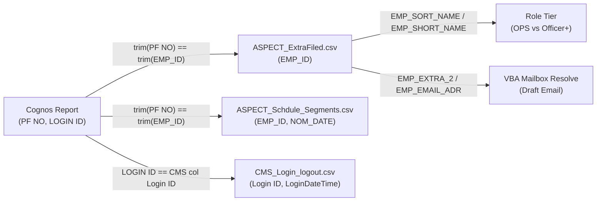
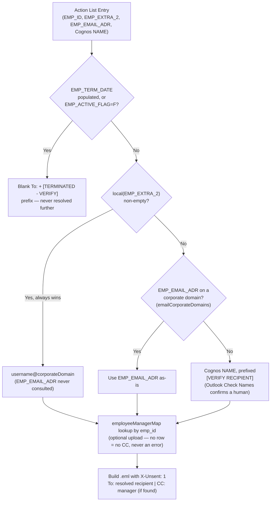
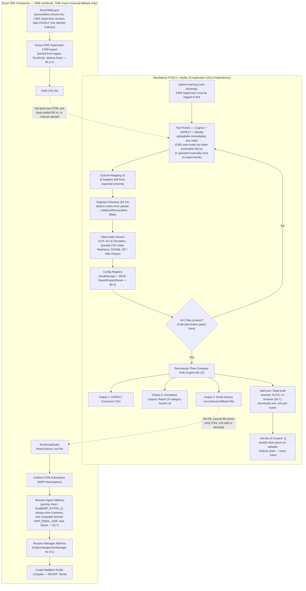

# TAA — Schedule vs Actual Reconciliation — PRD

## 1. Problem

Reconciling ASPECT schedules against actual login/logout (CMS) via the Cognos discrepancy report is manual today: a human reads each Cognos discrepancy, judges it against attendance rules, re-enters a corrective ASPECT segment (Late / Cover / Absent / Log off), and emails the agent + manager. This is slow and, worse, **Cognos's own numbers are provably wrong on a meaningful share of rows** — see §3 and §4. Manual reconciliation inherits those errors.

**This is a payroll system.** Scheduled-vs-attended hours drive pay. A false absence is unpaid work; a false "left early" is a wrongful deduction; a dropped overtime segment is unpaid premium-rate pay. Correctness requirements below are set by that stake, not by convenience.

**Goal:** make ASPECT match what actually happened on the ground. Output an ASPECT-uploadable correction file plus draft emails, without ever silently rewriting Cognos.

## 2. Existing automation (keep, don't duplicate)

`Automation.xlsm` (module `Run`) already does **data staging only**: file-picker import of Cognos + ASPECT, live CMS pull via Avaya CMS Supervisor COM, row cleaning, OT lookup, min/max CMS login join onto the Cognos sheet. It does **no rule classification, no corrective output, no email** — that's the gap this project fills. Its staging logic (import/clean filters, `HasFlexCode` keyword scan) is reusable; its CMS join is not (§4.3 Defect 2).

**Its validated CMS COM-automation sequence was ported into the VBA companion's `RunCMSExport`
macro (§6.3.1) with the code-quality/error-handling fixes described there — but that whole
companion, `RunCMSExport` included, was itself later removed (2026-09-08, see §6.3). CMS export
today has no automation of any kind; it's a plain manual upload.**

## 3. Source Specifications, Join Keys & Complete Column Dictionary

### 3.1 File Overview & Role in TAA System

| File | Format / Encoding | Size / Row Count | Role in TAA Architecture | Dirtiness / Core Trap |
|---|---|---|---|---|
| `ASPECT_Schdule_Segments.csv` | UTF-8 (fallback latin-1), quoted CSV | 4,683 clean rows → 1,389 (EMP_ID × NOM_DATE) groups | **Schedule ground truth**: contains all scheduled shifts, breaks, leaves, releases, overtime | `EMP_ID` space-padded; quoted fields contain pasted email threads — naive line/comma splitting breaks |
| `ASPECT_ExtraFiled.csv` | UTF-8 (fallback latin-1), quoted CSV | 2,199 unique employees, 1 row each (21 columns) | **Identity Master**: source of truth for username, section, team, role tier, and Outlook email resolution | *Historical naming note:* An earlier draft of the research notes described an old 19-col segment export under this name and referenced `ASPECT_ExtraFiled2.csv`. On disk, **`ASPECT_ExtraFiled.csv` is the true 21-column identity master**. `EMP_EXTRA_2` (corporate alias) is populated 74%; `EMP_EMAIL_ADR` populated 57%. **User-directed normalization: only the username (everything before `@`) is ever used from either field — full email addresses/domains are discarded.** Stripped, the two fields agree on 98.6% of rows where both exist; `EMP_ACTIVE_FLAG` = `T` on all rows; `EMP_TERM_DATE` populated on 2 |
| `Cognos_DescrepencyReport.csv` | **UTF-16 LE with BOM, Tab-delimited** | 502 clean rows (dated 27/08/2026) | **Management Discrepancy Report**: Official input to be annotated byte-identically with audit flags. Never overwritten | Real typos in headers (`SIGIN IN`/`SIGIN OUT`) must be preserved verbatim; quoted fields contain multiline pasted emails |
| `CMS_Login_logout.csv` | Standard CSV, `DD/MM/YYYY` | Punch events (Sample: 39 punches for agent 68858) | **Actual Attendance Truth**: Discrete login/logout badge punch timestamps from Avaya CMS | Line 1 is report title, Line 2 is Agent name/ID, Line 3 is header with duplicate labels; timestamps are discrete punches (deltas 1–6s), not sessions |
| `ASPECT_segment_Definition.xlsx` | OOXML ZIP (`.xlsx`) | 295 segment definitions (6 columns) | **Segment Dictionary**: Definition of segment codes, categories, and descriptions | `Default Duration` is stored as an Excel day fraction (`0.041666...` = 1 hour placeholder for 256/295 codes) — **never** use as real duration |
| `Rules to be taken.xlsx` | OOXML ZIP (`.xlsx`) | 8 rule categories × 2 tiers (23 sheet rows) | **Authoritative Policy Matrix**: Exact lateness, early logout, and absence threshold rules | Merged cells for rule categories and sections; authoritative policy (`Rules.txt` is deprecated) |
| `ASPECT_CSV_format.txt` | 1-line text specification | 1 row schema definition | **ASPECT Correction Output Spec**: Required schema for ASPECT desktop batch upload | **Every row (header AND data) MUST end with a trailing comma**, or ASPECT batch uploader rejects the file |

### 3.2 Join-Key Architecture & Relational Mapping



#### Measured Relational Facts & Join Traps
1. **Cognos `PF NO` ↔ ASPECT `EMP_ID`**:
   - `EMP_ID` in `ASPECT_Schdule_Segments.csv` and `ASPECT_ExtraFiled.csv` is **fixed-width 10-char space-padded** (e.g., `"4500483   "`).
   - Joining requires `trim(Cognos['PF NO']) == trim(ASPECT['EMP_ID'])`.
   - 502/502 Cognos `PF NO` match `ASPECT_ExtraFiled.csv` and `ASPECT_Schdule_Segments.csv`.
   - 1,389 employee IDs in `ASPECT_Schdule_Segments.csv` are a strict subset of the 2,199 in `ASPECT_ExtraFiled.csv` (810 employees had no scheduled segments on 28/08/2026).
2. **Cognos `LOGIN ID` ↔ CMS `Login ID`**:
   - Cognos `LOGIN ID` maps directly to CMS `Login ID` (column 2 in `CMS_Login_logout.csv`).
   - **Critical Trap — Never join CMS via `ASPECT_ExtraFiled.csv['EMP_EXTRA_3']`**: `EMP_EXTRA_3` holds a numeric badge ID that matches Cognos `LOGIN ID` on only 421/497 rows (76 mismatches). Example: PF `90135621` has Cognos `LOGIN ID` = `11451` vs `EMP_EXTRA_3` = `15327`. Always join CMS using Cognos `LOGIN ID`.
   - 5 Cognos rows have blank `LOGIN ID`: all 5 belong to `SECTION = "ACCESS CARD"` and have `LEAVE TYPE = "U-ABSENT"`.
3. **Cognos `SECTION` vs `PF NO` (`UAE*` contractor pattern)**:
   - All 122 rows where `PF NO` starts with `UAE*` have `SECTION = "NO SECTION"` (122/122 exact 1:1 equivalence).
   - In legacy staging (`Automation.xlsm`), rows with `SECTION` starting with `ACCESS CARD*` or `PF NO` starting with `UAE*` were dropped **silently and unconditionally**. **This is no longer the policy** — see §6.6: the new tool imports and evaluates every row by default; `ACCESS CARD*`/`UAE*` are offered only as optional, user-enabled config presets, never a silent hardcoded filter.

### 3.3 Data Caveats & Sampling Baseline
- **Date Non-Overlap in Samples:** The ASPECT segment export is dated **28/08/2026** (a UAE Public Holiday — Prophet Mohamed's Birthday); the Cognos sample is dated **27/08/2026**. Because the dates do not overlap, cross-file calculations were validated by internal consistency checks within each dataset.
- **Holiday Segment Skew:** Because 28/08/2026 was a public holiday, the segment mix is heavily skewed: 467 `P/H-LV` days, 136 `OFF` days, and only 660 active `SHIFT` days out of 1,389 employee-days. Do not treat these proportions as everyday operational distribution.
- **Untested Boundary Branches:** Leading (front-of-shift) releases, split shifts with intervals >60 min, and partial-day leave codes (`ANNL-5/6/7`, `Sick-4/9`) are modeled generically but had zero instances in the raw sample.

---

### 3.4 Complete Column Dictionary — Source by Source

#### Sheet 1: `ASPECT_Schdule_Segments.csv` (Schedule Segments Master)
- **File Format:** Quoted CSV, UTF-8 (fallback Latin-1).
- **Row Grain:** 1 row per scheduled activity segment (4,683 rows representing 1,389 unique `EMP_ID × NOM_DATE` employee-days).

| # | Exact Column Header | Data Type & Format | Sample Values | Fill Rate | Role in TAA Engine | Business Rules & Parsing Traps |
|---|---|---|---|---|---|---|
| 1 | `PRI_INDEX` | Integer (Sequential) | `1`, `2`, `3` | 4683/4683 (100%) | Reference | Line sequence number from ASPECT database export. |
| 2 | `EMP_SK` | BigInt / Float String | `-989083836532` | 4683/4683 (100%) | Reference | Surrogate surrogate key in ASPECT database. |
| 3 | `EMP_ID` | String (Fixed 10-char) | `"4500483   "`, `"UAE10402  "` | 4683/4683 (100%) | **Primary Join Key** | Space-padded employee PF/ID. **Must always be `.trim()`'d** before joining to Cognos `PF NO` or `ASPECT_ExtraFiled.csv`. |
| 4 | `EMP_LAST_NAME` | String | `"Tara Angelee Tampoc"` | 4683/4683 (100%) | Display | Employee full display name. |
| 5 | `EMP_FIRST_NAME` | String | `"ES OFCR,67645 -40H"`, `"11325,eMinds-40H"` | 4683/4683 (100%) | Secondary Tag | **Not a first name**: Contains legacy role tags, badge numbers, contract hours. |
| 6 | `EMP_SORT_NAME` | String | `"TARA ANGELEE TAMPOC,ES OFCR,67645 -40H"` | 4683/4683 (100%) | Secondary Scan | Concatenated uppercase name and role string. |
| 7 | `EMP_SHORT_NAME` | String | `"Tara Angelee Tampoc, ES OFCR,6"` | 4683/4683 (100%) | Secondary Scan | Truncated name string. |
| 8 | `EMP_SENIORITY` | String (Date format) | `"20180520000"` | 4033/4683 (86.1%) | Informational | Seniority ranking timestamp (`YYYYMMDD000`). |
| 9 | `EMP_EFF_HIRE_DATE` | Date (`DD/MM/YYYY`) | `20/05/2018`, `01/01/1900` | 4683/4683 (100%) | Informational | Effective hire date. `01/01/1900` indicates default/unset. |
| 10 | `NOM_DATE` | Date (`DD/MM/YYYY`) | `28/08/2026` | 4683/4683 (100%) | **Primary Group Key** | **The schedule day**: Pinned to the day the shift starts, even if it ends past midnight. Always group employee-days on `(EMP_ID, NOM_DATE)`. |
| 11 | `START_DATE` | Date (`DD/MM/YYYY`) | `28/08/2026`, `29/08/2026` | 4683/4683 (100%) | Segment Timestamp | Calendar date on which this *individual sub-segment* starts. Diverges from `NOM_DATE` for post-midnight segments (116 rows). |
| 12 | `SEG_CODE` | String (Uppercase Code) | `SHIFT`, `BREAK1`, `P/H-LV`, `OT1`, `RLS` | 4683/4683 (100%) | **Core Logic Key** | Segment code. Classified into schedule buckets (Schedule-defining, Adds, Reduces, Leave, Informational). |
| 13 | `START_MOMENT` | Datetime (`DD/MM/YYYY HH:MM:SS` or `DD/MM/YYYY`) | `28/08/2026 16:00:00`, `28/08/2026` | 3917/4683 (83.6%) | **Shift Calculation** | Segment start timestamp. **Bare date with no time (71 rows) means `00:00:00`**. Empty for structural full-day leaves. |
| 14 | `STOP_MOMENT` | Datetime (`DD/MM/YYYY HH:MM:SS` or `DD/MM/YYYY`) | `29/08/2026 00:00:00`, `29/08/2026` | 3917/4683 (83.6%) | **Shift Calculation** | Segment stop timestamp. **Bare date with no time (148 rows) means `00:00:00` (midnight)**. |
| 15 | `DURATION` | Integer (Minutes) | `480`, `15`, `60`, `0` | 3917/4683 (83.6%) | **Shift Calculation** | Segment duration in integer minutes. 100% matches `STOP_MOMENT - START_MOMENT` for `SHIFT`. |
| 16 | `MEMO` | String (Multiline Quoted) | Pasted emails, RTM notes | 445/4683 (9.5%) | Informational | Unstructured free text. May contain multiline email threads; requires quote-aware CSV parsing. |
| 17 | `RANK` | Integer | `211`, `128`, `86` | 4683/4683 (100%) | Dictionary Join | Maps 1:1 to `Rank` in `ASPECT_segment_Definition.xlsx`. |
| 18 | `EMP_CLASS_1` | String | `OTHER` | 4683/4683 (100%) | Ignored | Constant `OTHER` across all records in export. |
| 19 | `EMP_CLASS_1_DESCR`| String | `Other` | 4683/4683 (100%) | Ignored | Constant `Other` across all records in export. |

---

#### Sheet 2: `ASPECT_ExtraFiled.csv` (Employee Identity Master)
- **File Format:** Quoted CSV, UTF-8 (fallback Latin-1).
- **Row Grain:** 1 row per employee (2,199 unique employees).
- **Schema & Role:** 21 columns. Source of truth for employee identity, corporate alias, role tier keyword scan, and Outlook mailbox resolution.

| # | Exact Column Header | Data Type & Format | Sample Values | Fill Rate | Role in TAA Engine | Business Rules & Parsing Traps |
|---|---|---|---|---|---|---|
| 1 | `PRI_INDEX` | Integer | `1`, `2`, `3` | 2199/2199 (100%) | Reference | Sequence index. |
| 2 | `EMP_SK` | Scientific / String | `-9.9E+11` | 2199/2199 (100%) | Ignored | Corrupted/truncated by upstream Excel export. Do NOT use for joins. |
| 3 | `EMP_ID` | String (Padded/Unpadded) | `TSYED`, `16919`, `UAE10402` | 2199/2199 (100%) | **Primary Identity Key**| Employee PF number. Space-padded on 753 rows. Always `.trim()`. 755 contain alphanumeric prefixes (`UAE*`, `AC*`, `ERP*`, `TSYED`). |
| 4 | `EMP_LAST_NAME` | String | `"Ahmed Al Ali"` | 2199/2199 (100%) | Display | Employee last/full name. |
| 5 | `EMP_FIRST_NAME` | String | `"67357  MANAGER / SOCIAL MEDIA"` | 2199/2199 (100%) | Informational | Holds role descriptions, team tags, or badge numbers. |
| 6 | `EMP_SORT_NAME` | String | `"AHMED AL ALI,67357  MANAGER"` | 2199/2199 (100%) | **Role Tier Scan** | Concatenated uppercase name & role. **Primary target for role tier keyword scan**. |
| 7 | `EMP_SHORT_NAME` | String | `"Ahmed Al Ali, 67357  MANAGER"` | 2199/2199 (100%) | **Role Tier Scan** | Short name & role. Secondary target for role tier keyword scan. |
| 8 | `EMP_SENIORITY` | String | `"GQ"`, `"20060514000"` | 1738/2199 (79.0%) | Informational | Seniority ranking code or timestamp. |
| 9 | `EMP_EFF_HIRE_DATE` | Date (`DD/MM/YYYY`) | `05/12/2000`, `01/01/1900` | 2199/2199 (100%) | Informational | Effective hire date. |
| 10 | `EMP_TERM_DATE` | Date (`DD/MM/YYYY`) | `04/06/2009`, `16/04/2026` | 2/2199 (0.09%) | Validation Gate | Termination date. When populated, flag drafts rather than emailing terminated staff. |
| 11 | `EMP_ACTIVE_FLAG` | Char (`T`/`F`) | `T` | 2199/2199 (100%) | Validation Gate | Active flag (`T` for all 2,199 rows in current snapshot). |
| 12 | `EMP_TIME_ZONE` | String | `"(GMT+ 04:00) Abu Dhabi, Muscat"`| 2199/2199 (100%) | Informational | Time zone configuration. |
| 13 | `EMP_EMAIL_ADR` | String | `aalali@thecontactcentre.`, `al_wafa@hotmail.com` | 1255/2199 (57.1%) | Outlook resolve input | **Domain is never used** — only the local part before `@` (the username) is passed to Outlook resolution, so domain validity (`.`-truncation, personal domains, Lotus Notes paths) stops being disqualifying on its own; the resolve attempt just fails and falls through. Once stripped, this matches `EMP_EXTRA_2` on 959/973 (98.6%) of rows where both are populated. |
| 14 | `EMP_MEMO` | String (Multiline) | Pasted emails, JobTitle fragments | 1356/2199 (61.7%) | Informational | Contains notes. Only 6 rows contain `JobTitle:`. Do not parse as structured role source. |
| 15 | `EMP_CLASS_1` | String | `OTHER` | 2199/2199 (100%) | Ignored | Constant `OTHER`. |
| 16 | `EMP_CLASS_1_DESCR`| String | `Other` | 2199/2199 (100%) | Ignored | Constant `Other`. |
| 17 | `EMP_EXTRA_1` | String | `aalali@thecontactcentre.ae` | 15/2199 (0.68%) | Ignored | Sparsely populated secondary email field. |
| 18 | `EMP_EXTRA_2` | String | `aalali`, `ashamsi`, `fmurad` | 1625/2199 (73.9%) | **Outlook resolve input**| **Corporate Exchange username alias, already domain-free.** Used directly for Outlook COM recipient resolution (`CreateRecipient(alias)`) — no stripping needed on this field, but treat it the same way as `EMP_EMAIL_ADR` for consistency (`local()` is a no-op here since there's no `@`). |
| 19 | `EMP_EXTRA_3` | String (Numeric) | `67357`, `68628`, `68613` | 1613/2199 (73.4%) | Reference Badge | Legacy badge number. **Mismatches Cognos `LOGIN ID` on 76 rows**. Do not use for CMS joins. |
| 20 | `EMP_EXTRA_4` | String | `PRESTIGE`, `SALES`, `ECS`, `ACCESS CARD` | 1317/2199 (59.9%) | Tier Corroboration | Department / Role tag (101 distinct values). Corroborating signal for role tier; 19 rows tagged `ACCESS CARD`. |
| 21 | `START_DATE` | Date (`DD/MM/YYYY`) | `01/08/2026` | 2199/2199 (100%) | Reference | ExtraFiled snapshot creation date (constant `01/08/2026`). Not a shift date. |

---

#### Sheet 3: `Cognos_DescrepencyReport.csv` (Management Discrepancy Report)
- **File Format:** UTF-16 LE with BOM (`\xff\xfe`), Tab-delimited (`\t`).
- **Row Grain:** 1 row per discrepancy record (502 rows, dated 27/08/2026).
- **Core Requirement:** Re-emitted **byte-identically** with appended `TAA_*` analysis columns.

| # | Exact Column Header (Typo Verbatim) | Data Type & Format | Sample Values | Fill Rate | Role in TAA Engine | Business Rules & Parsing Traps |
|---|---|---|---|---|---|---|
| 1 | `SIGN IN DATE` | Datetime String | `2026-08-27 00:00:00` | 502/502 (100%) | Reference | Cognos report shift date (`YYYY-MM-DD HH:MM:SS`). |
| 2 | `SECTION` | String | `ECS`, `PRESTIGE`, `NO SECTION`, `ACCESS CARD` | 502/502 (100%) | Staging Filter | Department name. All 122 `UAE*` employees have `NO SECTION`. Inconsistent casing/abbreviations; **never derive role tier from SECTION**. |
| 3 | `PF NO` | String | `4500116`, `28320`, `UAE10402` | 502/502 (100%) | **Primary Join Key** | Employee PF number. Joins to `ASPECT_Schdule_Segments.csv['EMP_ID']` and `ASPECT_ExtraFiled.csv['EMP_ID']`. |
| 4 | `NAME` | String | `"Walid Mohamed Al Tawil"` | 502/502 (100%) | Display | Employee name from Cognos system. |
| 5 | `LOGIN ID` | String | `67356`, `11495`, `67546` | 497/502 (99.0%) | **CMS Join Key** | Agent CMS login ID. Joins directly to `CMS_Login_logout.csv['Login ID']`. Blank on 5 rows (`ACCESS CARD` accounts). |
| 6 | `DUTY1` | String (`HH:MM - HH:MM`) | `08:00 - 16:00`, `07:00 - 15:00` | 500/502 (99.6%) | **Shift Definition** | First scheduled shift block. 34 rows are cross-midnight (start clock ≥ stop clock, e.g. `23:00 - 07:00`). |
| 7 | `OT1` | String | *(Always Blank)* | 0/502 (0.0%) | Overtime (Unused) | Overtime for Duty 1. **Always empty in Cognos export**. Must be backfilled from ASPECT `OT1` segments. |
| 8 | `DUTY-2` | String (`HH:MM - HH:MM`) | `16:00 - 17:00`, `17:00 - 18:00` | 50/502 (10.0%) | **Second Shift Block**| Second scheduled shift block. 23/50 are completely cancelled by identical-window releases (Rule #8). |
| 9 | `OT-2` | String | *(Always Blank)* | 0/502 (0.0%) | Overtime (Unused) | Overtime for Duty 2. Always empty in Cognos export. |
| 10 | `SCH DURATION` | String (`H:M`) | `8:0`, `8:4`, `7:0`, `9:30` | 502/502 (100%) | Validation Check | Net scheduled duration in `H:M` (minutes are NOT zero-padded: `8:4` = 8h 04m = 484m). Equals `DUTY1` length on 345/502 rows. |
| 11 | `SIGNIN DURATION` | String (`HH:MM`) | `00:00`, `08:00`, `04:02` | 502/502 (100%) | Informational | Total actual sign-in duration calculated by Cognos. `00:00` on 215 rows: 192 are the legitimate "never signed in" placeholder (blank SIGIN IN/OUT + a leave/absence code), 4 are a genuine single swipe (SIGIN IN == SIGIN OUT), and 19 are a Cognos calculation failure — SIGIN IN/SIGIN OUT sit real hours apart and Cognos itself derived LATE START/LEFT EARLY from them, but left the duration at `00:00`. The comparison engine (`cognosComparison.ts`) reports the first two as NOT_COMPARABLE (a genuine measurement-quantity or no-attendance case) but flags the 19-row failure as a real MISMATCH — informational does not mean a mismatch there is inert: it still sets `holdReason = MISMATCH_FOUND`, which withholds the row from the ASPECT correction CSV pending review. |
| 12 | `SIGIN IN` | Time String (`HH:MM`) | `07:29`, `07:58`, `14:30` | 310/502 (61.8%) | Unreliable Audit | First login time recorded by Cognos. **Loses calendar date on night shifts**. Recomputed from CMS datetime punches. |
| 13 | `SIGIN OUT` | Time String (`HH:MM`) | `15:29`, `12:00`, `00:46` | 310/502 (61.8%) | Unreliable Audit | Last logout time recorded by Cognos. Recomputed from CMS datetime punches. |
| 14 | `LATE START` | Integer String (Minutes) | `-480`, `-29`, `1`, `0` | 502/502 (100%) | Cognos Variance | Cognos uncorrected late variance (`rawScheduledStart - actualFirstLogin`). Negative = late. `-480`/`-540` = full shift miss. |
| 15 | `LEFT EARLY` | Integer String (Minutes) | `-480`, `29`, `-240`, `-60` | 502/502 (100%) | Cognos Variance | Cognos uncorrected early leave (`actualLastLogout - endOfLastScheduledBlock`). Negative = left early. |
| 16 | `LEAVE TYPE` | String | `ANNUAL`, `U-ABSENT`, `ABSENT` | 208/502 (41.4%) | Leave Audit | Cognos recorded leave type (`ANNUAL`: 110, `U-ABSENT`: 42, `ABSENT`: 17, `Absent NS/NC`: 15, `PLN_SK`: 9). `U-ABSENT` is often a false positive due to Defect 2. |
| 17 | `LEAVE HR` | Integer String (Minutes) | `0`, `480`, `540`, `600` | 502/502 (100%) | Leave Audit | Leave duration in integer minutes. `0` when working or on partial leave. |
| 18 | `REMARK` | String (Multiline Quoted) | `RLS:15:00 - 16:00( -60 Minutes) : ...` | 299/502 (59.6%) | **Carve-out Grammar** | Structured schedule modifications (RLS, UN_RLS, NURSNG, COVER, LATE). `(±N Minutes)` is **already net of COVER**. |

---

#### Sheet 4: `CMS_Login_logout.csv` (Avaya CMS Actual Punches)
- **File Format:** CSV, `DD/MM/YYYY`.
- **Structure:** Line 1 = Report Title, Line 2 = Agent Header (`Agent:,<name>_<id>`), Line 3 = Header Row, Lines 4+ = Punch event rows.
- **Punch Model:** Discrete badge punch events (Login and Logout timestamps differ by only 1 to 6 seconds; ~2 punches per day).

| Positional Col # | Header Label (Duplicate) | Data Type & Format | Sample Values | Role in TAA Engine | Business Rules & Parsing Traps |
|---|---|---|---|---|---|
| Col 1 | `Date` | Date (`DD/MM/YYYY`) | `02/08/2026`, `28/08/2026` | Audit Date | Calendar date of the punch event. Do NOT filter join by this date (Defect 2). |
| Col 2 | `Login ID` | String | `68858` | **Primary Join Key** | Agent CMS login ID. Joins to Cognos `LOGIN ID`. |
| Col 3 | `Login Time` | Time (`HH:MM`) | `18:01`, `07:25` | Ignored | Time-only field. **Do NOT use** (loses date for cross-midnight joins). |
| Col 4 | `Logout Time` | Time (`HH:MM`) | `18:01`, `07:25` | Ignored | Time-only field. **Do NOT use**. |
| Col 5 | `Login Time` | Datetime (`DD/MM/YYYY HH:MM:SS`) | `02/08/2026 18:01:46` | **Actual First Login** | Full punch login timestamp. **Primary column for shift start attendance**. |
| Col 6 | `Logout Time` | Datetime (`DD/MM/YYYY HH:MM:SS`) | `02/08/2026 18:01:49` | **Actual Last Logout** | Full punch logout timestamp. **Primary column for shift end attendance**. |

- **Multi-day sessions (2026-09-27):** a row whose logout lands **two or more calendar days** after
  its `Date` (e.g. login 24th, logout 27th — the agent never logged out) is real CMS data, not a
  corrupt file. The upload **accepts** it (it used to reject the whole multi-file batch), shows a
  non-blocking notice listing each such row, and flags the punch `spansMultipleDays`. Every
  reconciliation row the session touches — the shift it was attributed to, plus every real shift
  window it overlaps for that Login ID — is force-held `MULTI_DAY_CMS_SESSION` (verdict
  `MULTI_DAY_CMS_SESSION`, action `MANUAL_REVIEW_REQUIRED`): never auto-Present, never auto-Absent.
  Leave-day synthetic windows are held only if the session was attributed to them. A logout
  before the row's date, before the login, or disagreeing between the two logout columns still
  rejects the file.

---

#### Sheet 5: `ASPECT_segment_Definition.xlsx` (Segment Dictionary)
- **File Format:** OOXML ZIP (`.xlsx`), Sheet `xl/worksheets/sheet1.xml`.
- **Row Grain:** 295 segment definition rows.

| # | Exact Column Header | Data Type | Sample Values | Role in TAA Engine | Business Rules & Parsing Traps |
|---|---|---|---|---|---|
| 1 | `Rank` | Integer String | `1`, `2`, `211` | Join Key | Maps 1:1 with `RANK` column in `ASPECT_Schdule_Segments.csv`. |
| 2 | `Code` | String | `SHIFT`, `RLS`, `ANNUAL` | **Segment Code** | The code referenced in ASPECT schedules and upload files. |
| 3 | `Description` | String | `"Shift (container)"`, `"Release staff"` | Display / Meaning | Human-readable description of the segment code. |
| 4 | `Default Duration` | Float (Excel Day Fraction) | `0.0416666666666667` (= 1h), `0.375` (= 9h) | **Placeholder Trap** | Stored as fraction of a 24-hour day. 256/295 codes default to `0.041666...` (1 hour). **NEVER use as real segment duration**; always use `START_MOMENT` and `STOP_MOMENT`. |
| 5 | `Updated By` | String | `SISMAIL`, `ahmbaioumy`, `FAHMED` | Audit | User ID of the WFM administrator who last updated the definition. |
| 6 | `Updated On` | Float (Excel Serial Date) | `44209.5328935185` | Audit | Timestamp of last modification in Excel date serial format. |

---

#### Sheet 6: `Rules to be taken.xlsx` (Authoritative Policy Matrix)
- **File Format:** OOXML ZIP (`.xlsx`), Sheet `xl/worksheets/sheet1.xml`.
- **Structure:** 23 sheet rows representing 8 rule categories across 2 employee tiers. Merged cells define rule hierarchies.

| # | Exact Column Header (Typo Verbatim) | Data Type | Sample Values | Role in TAA Engine |
|---|---|---|---|---|
| 1 | `SN` | Integer String / Blank | `1`, `2`, `3`..`8`, `""` | Rule category sequence number. Blank on sub-tier rows due to merged cells. |
| 2 | `Segmnet Type ` | String / Blank | `"Late Login "`, `"Early logout "` | Attendance variance condition. |
| 3 | `Section ` | String / Blank | `"OPS staff "`, `"Officers - Coordinators -Analyst - Specialest "` | Target employee role tier. |
| 4 | `Duration ` | String | `"6 minutes to 60 minutes "`, `"61 minutes and above "` | Threshold range for the variance duration. |
| 5 | `TAA Action ` | String | `"Mark late & cover to be added next day "`, `"Mark Absent"` | Required schedule update action to emit to ASPECT upload CSV. |
| 6 | `Communication to OPS` | String | `"NA"`, `"Send email to OPS "`, `"Send email to staff CC staff manager "` | Email routing rule for the VBA email companion actions list. |

---

#### Sheet 7: `ASPECT_CSV_format.txt` (Correction Upload Output Spec)
- **File Format:** 1-line text header specification.
- **Specification:** `Code,ID,SegmentCode,nominateDate,SegmentDate,SegmentStarttime,Segmentduration,Memo,`
- **Output Rule:** Every line (the header AND every data row) must terminate with a **trailing comma** (empty 9th field).

| Field # | Header Field Name | Data Type & Format | Sample Value | Source Mapping / Generator Logic |
|---|---|---|---|---|
| 1 | `Code` | String / Constant | `00` (insert new segment), `10` (original segment being replaced), `11` (replacement segment) | User-confirmed action code (§8, resolved): `00`=`aspectNormalActionCode` for every insert-type action (LATE, COVER, ABSENT, Log_off, plus Rule 8's released-time SHIFT rows and leftover OT pieces); `10`/`11`=`shiftUpdateOriginalCode`/`shiftUpdateNewCode`, always emitted as a pair for a change (10 first, 11 directly beneath it) — flex shift update (§4.8), Rule 8 OT/RLS adjustment, §4.6c Absent-day OT→SHIFT replace, §4.6e SHIFT→OT2 replace. |
| 2 | `ID` | String (Trimmed PF) | `4500483` | `trim(ASPECT_ExtraFiled['EMP_ID'])` or `trim(Cognos['PF NO'])`. |
| 3 | `SegmentCode` | String | `LATE`, `COVER`, `ABSENT`, `Log_off` | Action segment code determined by rule engine matching. |
| 4 | `nominateDate` | Date (`DD/MM/YYYY`) | `28/08/2026` | The `NOM_DATE` of the schedule this correction BELONGS TO in ASPECT (the owning schedule day, not necessarily the incident day). Same-day actions (LATE, Log_off, ABSENT, shift-update pairs) use the incident schedule's own `NOM_DATE`. A placed `COVER` is the exception: it belongs to the RESOLVED TARGET working schedule (§4.11's `targetDateStr`), so `nominateDate` is the target day's `NOM_DATE` — never the original late/early incident's `NOM_DATE`. The incident date is preserved in `Memo` for traceability. |
| 5 | `SegmentDate` | Date (`DD/MM/YYYY`) | `28/08/2026` or `29/08/2026` | The PHYSICAL calendar date the correction's own instant falls on (`reconciliationEngine.ts`'s `formatSegmentDate()`, derived from the same `Date` as `SegmentStarttime`) — usually the shift's nominal day, but NOT always: a cross-midnight `Log_off`/`LATE`/flex shift-update event, or a `COVER` whose target day is itself a night shift or already carries a stacked cover, can land on a later calendar day than `nominateDate`. Never hardcode `nominateDate` here. Empty for a day-level `ABSENT`/`Absent NS/NC` marker, which has no single instant. |
| 6 | `SegmentStarttime`| Time (`HH:MM` or `HH:MM:SS`) | `08:00` | Start time of the corrective segment. (Empty for full-day `ABSENT`). |
| 7 | `Segmentduration` | `HH:MM` | `00:15`, `01:00`, `08:00` | Duration formatted `HH:MM` for every row (not just the flex shift-update pair). (Empty for full-day `ABSENT`). |
| 8 | `Memo` | String, always double-quoted | `"TAA Auto Reconciliation"` | Explanatory note for the audit log. **Always wrapped in `"..."` regardless of content** — not conditional CSV escaping like the other fields. |
| 9 | *(Trailing Empty)*| Empty delimiter | `""` | **Mandatory trailing comma** required by ASPECT uploader. |

### 3.5 Strict Local Date/Time Contract

- All payroll timestamps are local wall-clock values. The parser accepts only `DD/MM/YYYY[ HH:MM[:SS]]` and `YYYY-MM-DD[ HH:MM[:SS]]`; it never falls back to browser/locale-native date guessing.
- Calendar components and clock ranges are validated exactly. Impossible dates, `24:00`, minute/second values above 59, reversed ASPECT spans, and incomplete schedule-defining spans fail closed.
- A documented bare ASPECT date remains valid and means `00:00:00`. Empty timestamps remain valid only for structural/no-effect leave entries; additions and removals require usable time evidence, except a completely bare (no duration, no timestamps) removal, or a bare non-schedule-defining addition, which is a **full-day segment** (decision 2026-09-21): its duration is the day's own scheduled duration (SHIFT + OT + COVER); `defaultFullDaySegmentDurationMinutes` (480) is only the fallback when the day has no schedule. A full-day removal takes whatever is left of the schedule after every timed removal (scheduled hours 0, window collapsed) and raises the soft, reviewer-releasable `FULL_DAY_REMOVAL_ON_SCHEDULED_DAY` hold; a full-day addition never adds on top of an existing schedule. `REMOVAL_SEGMENT_DURATION_UNKNOWN` now only fires for a removal with a half-specified timestamp pair. Codes left `NO_EFFECT` (ANNUAL, P/H-LV, SICK...) are untouched, and LEAVE HR is still never defaulted.
- Invalid Cognos `SIGN IN DATE` values are locked as `UNPARSEABLE_SIGN_IN_DATE`; malformed ASPECT schedule values are locked as `INVALID_ASPECT_DATETIME`; invalid Config Registry clocks are locked as `INVALID_CONFIG_TIME`; invalid or contradictory CMS files are rejected as a whole before punches enter reconciliation (a session spanning two or more days is NOT invalid — it is loaded and every row it covers is locked as `MULTI_DAY_CMS_SESSION`; see Sheet 4). Only `MISMATCH_FOUND` may be manually included; all evidence-integrity holds stay locked until corrected and recalculated.

---

## 4. Rule Engine & Validated Arithmetic

### 4.1 Authoritative Rules Matrix (`Rules to be taken.xlsx`)

The table below is the complete, verbatim business policy from `Rules to be taken.xlsx`. All thresholds, actions, and communication rules must be loaded as an editable configuration table (in `localStorage` + JSON export/import), never hardcoded.

**Generic evaluator, not hardcoded branches:** Model each row below as data — `{category, tier, minMinutes, maxMinutes, action, communication}` — and have the rule engine look up the matching row instead of branching on category/tier in code. This is what makes "every rule parameter user-editable" true in practice, not just in spirit: changing a threshold means editing a config row, never touching engine code.

| # | Segment Type | Role Tier | Duration / Condition | TAA Action | Communication Action |
|---|---|---|---|---|---|
| 1 | Late Login | OPS Staff | 6 to 60 minutes | Mark late & add cover (next eligible day, or same day if already covered) | NA (No email) |
| | | OPS Staff | 61 minutes and above | Mark Absent | Send email to OPS |
| | | Officer / Coord / Analyst / Specialist | 11 to 60 minutes | Mark late & add cover (next eligible day, or same day if already covered) | NA (No email) |
| | | Officer / Coord / Analyst / Specialist | 61 minutes and above | Mark Absent | Send email to staff, CC staff manager |
| 2 | Early Login | Both Tiers | Any duration | **No Action** | NA |
| 3 | Early Logout | OPS Staff | 5 to 9 minutes | Mark log off & add cover (next eligible day, or same day if already covered) | NA (No email) |
| | | OPS Staff | 10 minutes and above | Mark Absent | Send email to OPS |
| | | Officer / Coord / Analyst / Specialist | 6 to 20 minutes | Mark log off & add cover (next eligible day, or same day if already covered) | NA (No email) |
| | | Officer / Coord / Analyst / Specialist | 21 minutes and above | Mark Absent | Send email to staff, CC staff manager |
| 4 | Late Logout | OPS Staff | 1 hour and above (60+ min) | Mark Absent | Send email to OPS |
| | | Officer / Coord / Analyst / Specialist | 1 hour and above (60+ min) | Mark Absent | Send email to staff, CC staff manager |
| 5 | No Login Record | OPS Staff | NA (No CMS punches) | Mark Absent NS/NC | Send email to OPS |
| | | Officer / Coord / Analyst / Specialist | NA (No CMS punches) | Mark Absent NS/NC | Send email to staff, CC staff manager |
| 6 | No Login or No Logout | OPS Staff | NA (Single punch only) | Mark Absent | Send email to OPS |
| | | Officer / Coord / Analyst / Specialist | NA (Single punch only) | Mark Absent | Send email to staff, CC staff manager |
| 7 | Cover Not Attended | OPS Staff | 5 to 9 minutes | Mark Absent | NA (Blank) |
| | | OPS Staff | 10 minutes and above | Mark Absent | Send email to OPS |
| | | Officer / Coord / Analyst / Specialist | 6 to 19 minutes | Mark Absent | NA (Blank) |
| | | Officer / Coord / Analyst / Specialist | 20 minutes and above | Mark Absent | Send email to staff, CC staff manager |
| 8 | RLS added to OT with no adjustment | Both Tiers | NA (Second shift / OT cancelled by RLS) | Adjust the OT duration with RLS | NA |

#### Timing & Placement Policy
- **LATE:** Segment added on the **same day** as the shift (`SegmentDate = NOM_DATE`), starting at scheduled shift start for `lateMinutes` duration.
- **COVER:** A newly assigned cover is added on the **next eligible working day strictly after** the incident (see §4.11 Step 1 for the full target-day algorithm, including the run-date floor), placed after the last segment of that day — not simply "shift end". **Exception:** when `coverSameDayWhenAlreadyCovered` is on and the agent provably already worked the full cover window on the incident day itself, the cover is credited on that **same day** instead (§4.11 Step 1's exception).
- **LOG OFF:** Segment added on the **same day**, covering the early leave window.
- **ABSENT / Absent NS/NC:** Full-day day-level marker on the **same day** (`nominateDate = NOM_DATE`, empty start time, empty duration).
- **Already actioned (business decision 2026-09-27):** when ASPECT already holds a `LATE` segment on the incident's schedule day (NOM_DATE), a Late-and-Cover finding is treated as actioned outside TAA — **no `LATE` and no `COVER`** are emitted, whatever the recorded segment's start or minutes (a recorded 8m LATE against TAA's measured 10m is never topped up with a second LATE). The same applies to `Log_off` for a Log-off-and-Cover finding. The row keeps its verdict (`LATE` / `EARLY_LOGOUT`) with `TAA_ACTION = NO_ACTION` and a trace naming both figures; a flex over-cutoff row keeps only its 10/11 shift-update pair (`SHIFT_UPDATE_FLEX`). Never applies to the ABSENT band (61m+ still marks Absent). Previously an exact-match LATE skipped only the marker and still added the COVER. `reg-142`, `reg-143`, `reg-187`, `reg-188`. The late code itself is config (`lateSegmentCode`, default `LATE`). An **authorised late** (`LATE-A`) or a technical segment excuses late minutes per §4.15a — unlike a recorded `LATE`, only the minutes it actually covers are excused.

---

### 4.2 Role Tier Keyword Classification (`HasFlexCode` Technique)
Role tier is derived dynamically by scanning `EMP_SORT_NAME` and `EMP_SHORT_NAME` from **`ASPECT_ExtraFiled.csv`** (2,199 unique employees):
- Case-insensitive substring match against keyword list: `OFFICER`, `OFCR`, `ANALYST`, `SPECIALIST`, `COORDINATOR`, `SUPERVISOR`.
- Keyword distribution: `OFCR` (51), `ANALYST` (50), `OFFICER` (24), `SPECIALIST` (5), `COORDINATOR` (4), `SUPERVISOR` (1).
- **2,064 / 2,199 employees (93.9%) have no keyword matches → Default to OPS Staff tier**.
- `EMP_EXTRA_4` serves as a secondary corroborating signal (101 values, e.g., `PRESTIGE OFCR`, `Analyst`, `ECS OFCR`).
- **Do NOT use Cognos `SECTION` for tier derivation**: It disagrees with ASPECT identity on 36 employees and reflects departmental hierarchy rather than individual role policy.

---

### 4.3 Proven Cognos Defects Replaced by Correct Formulas

#### Defect 1 — Raw-Window Calculation Bug (41/502 rows, 8.2% False Early Leave)
Cognos calculates `LEFT EARLY = actualLastLogout - endOfRawScheduledShift`, completely ignoring releases (`RLS`) and nursing hours (`NURSNG`) recorded in its own `REMARK` column.
- *Verified Formula:*
  $$\text{effectiveEnd} = \text{endOfLastScheduledBlock} - \sum(\text{trailing releases and nursing})$$
  $$\text{effectiveStart} = \text{rawScheduledStart} + \sum(\text{leading releases})$$
  $$\text{lateMinutes} = \text{actualFirstLogin} - \text{effectiveStart} \quad (>0 \implies \text{Late})$$
  $$\text{earlyLeaveMinutes} = \text{effectiveEnd} - \text{actualLastLogout} \quad (>0 \implies \text{Left Early})$$
- *Empirical Proof:* Releases always carve from the back of the shift (4/4 co-occurrences: `release.stop == shift.stop`).
- *Worked Regression Cases:*
  - **Eman Eltayeb:** Shift 07:00–15:00, `NURSNG` 14:00–15:00 (effective end = 14:00), logged out at **14:13**. Cognos says `LEFT EARLY = -47`. Correct result: Logged out 13 min past effective end → **No Action**.
  - **Minas Alabbas:** Shift 09:00–17:00, `NURSNG` 16:00–17:00 (effective end = 16:00), logged out at **16:00**. Cognos says `LEFT EARLY = -60`. Correct result: Exact match → **No Action**.

#### Defect 2 — Date-Keyed CMS Join Bug (34/502 rows, 6.8% False ABSENT)
**This is the single highest-value fix in the project** — it is the only defect that flips a present, on-time employee into a full-shift unauthorized absence (`U-ABSENT`), the most payroll-damaging verdict Cognos can produce.

Legacy automation filtered `CMS.Date = nominateDate`. For shifts crossing midnight, the logout punch lands on the following calendar day, making it invisible to date-keyed joins and falsely marking staff as full-shift unauthorized absentees (`U-ABSENT`).

| PF NO | Scheduled Shift | Actual First Login | Actual Last Logout | Cognos LEFT EARLY | Cognos False Verdict | True TAA Status |
|---|---|---|---|---|---|---|
| `4507957` | 23:00–07:00 | 23:08 | 23:08 (next-day lost) | -472 | **U-ABSENT** | Present, 8 min Late → **Late + Cover** |
| `90135621`| 19:00–03:00 | 18:57 | 18:57 (next-day lost) | -503 | **U-ABSENT** | Arrived 3 min early → **On Time / Present** |

- *Mandatory Time-Window Join Formula:*
  $$\text{Punches} = \{ p \in \text{CMS} \mid p.\text{LoginID} = \text{Cognos}.\text{LoginID} \land p.\text{DateTime} \in [\text{shiftStart} - \text{grace}, \text{shiftEnd} + \text{grace}] \}$$
  $$\text{actualFirstLogin} = \min(\text{Punches}.\text{DateTime}), \quad \text{actualLastLogout} = \max(\text{Punches}.\text{DateTime})$$

---

### 4.4 Scheduled Duration & REMARK Grammar
- **Validated Net Scheduled Formula (reproduced ±1 min on 500/500 Cognos rows):**
  $$\text{netScheduledMinutes} = \text{DUTY1} + \text{OT1} + \text{DUTY-2} + \text{OT-2} + \text{COVER} - \sum(\text{release/nursing deductions})$$
- **REMARK Grammar & Code Frequencies (502 rows):**
  - Codes: `COVER:` (135), `RLS:` (38), `LATE:` (24), `NURSNG:` (16), `UN_RLS:` (9).
  - *Occurrences vs. rows:* counts above are total tag occurrences (a `REMARK` field can carry two `COVER:` tags concatenated with no separator). Counted by **distinct row**, `COVER` appears on 125/502 rows (10 rows carry two `COVER` tags); all other codes are 1-per-row, so their row-counts equal the occurrence-counts above.
  - Format: `CODE:HH:MM - HH:MM( ±N Minutes) : <free text comments>`
  - **Critical Arithmetic Rule:** The parenthesized figure `( ±N Minutes)` is **already net of any COVER in that row**. Never subtract COVER twice.

---

### 4.5 Duty & Overtime Semantics
- **`DUTY1` vs `DUTY-2`:** `DUTY1` represents the main shift (populated on 500/502 rows). `DUTY-2` represents a scheduled second shift (populated on 50/502 rows). 36 are 60 min, 10 are 120 min, 2 are 90 min, 2 are 30 min. Gaps between `DUTY1` and `DUTY-2` are strictly 0 min (16 rows) or 60 min (34 rows).
- **Rule #8 Cancellation:** 23 of the 50 second shifts in Cognos are completely cancelled by an identical-window `RLS` (e.g. `DUTY-2 16:00-17:00` with `RLS 16:00-17:00`), netting to zero duration.
- **OT1 vs OT2 Separation:**
  - `OT1` = Normal Overtime (always extends a regular `SHIFT` segment, starts at/after `SHIFT.stop`).
  - `OT2` = Public Holiday Overtime (stands alone on `P/H-LV` days with NO shift; 9 employee-days of 480–600 min).
  - `OT1` and `OT2` carry different payroll rates and must **never be summed or merged**.
  - Cognos never carries overtime (`OT1` and `OT-2` are 100% blank in Cognos exports); both must be populated from ASPECT before evaluation.

---

### 4.6 Two Separate Gates — Attendance-Rule Gate vs. Leave-Day Integrity Check

**⚠️ This section replaces an earlier, self-contradictory single-gate design.** An earlier draft said "skip the day entirely" for no-SHIFT/no-OT days — but that cannot coexist with §4.6b below, which requires inspecting CMS logins on exactly those days. A day is **never fully skipped**; it always routes through one of two gates:

**4.6a — Attendance-rule gate** (late/early-logout/cover/no-login rules from §4.1):
$$\text{Evaluate under normal rules if } (\exists \text{ SHIFT} \lor \exists \text{ OT1} \lor \exists \text{ OT2})$$
$$\text{Route to §4.6b instead if } (\neg \exists \text{ SHIFT} \land \neg \exists \text{ OT1} \land \neg \exists \text{ OT2})$$
- **Two-way payroll risk if this gate is implemented wrong:**
  - Too inclusive $\implies$ Staff on scheduled `OFF` / `ANNUAL` marked absent without cause.
  - Too exclusive $\implies$ Public holiday `OT2` work silently dropped from payroll.

**4.6b — Leave-day integrity check** (new, narrower, runs only on days that failed 4.6a — i.e. no SHIFT, no OT, but a leave/off segment present):
- Fetch CMS punches for the day exactly as in §4.3 Defect 2 (time-window join, never date-keyed).
- **No login at all** → correctly excluded, **no action**, even if Cognos flags the row as a discrepancy (this is a Cognos false positive — see §4.11 category 4, "No action required").
- **Login totaling ≥ 60 minutes** (config-editable, `leaveLoginThresholdMinutes`, default `60`) → the leave segment is anomalous: convert it to `ABSENT` + an explanatory note, and flag for manual review (§4.11 category 3). Do not attempt to guess a "real" schedule for the day — there isn't one to compare against.
- **Login below 60 minutes** → treated as noise (a brief check-in), **no action**.
- **Applies to every full-day-leave code generically** (`ANNUAL`, `P/H-LV`, `OFF`, `LEAVE`, `SICK`, etc.) — this is not an ANNUAL-specific rule, it is the general "validate before acting" principle (§4.11) applied to the one case where there's no schedule to recompute against.

### §Leave Segments — configuration backing §4.6a/§4.6b (supersedes the retired glossary flag)

Which segment codes actually gate §4.6a/§4.6b and count as "leave" for reporting is **not** part
of the §4.14 discovery-driven glossary — it is a dedicated Config Registry mechanism, edited on
its own **Leave Segments** page (`LeaveSegmentsView.tsx`, reachable from the sidebar), independent
of the glossary's Addition/Removal/No-Effect/write-only classification.

Two config arrays, both matched case-insensitively via the same `isCodeInConfiguredSet` helper the
glossary uses, so a newly configured code can never trigger one without the other:

- **`config.nonWorkingDaySegmentCodes`** — the full-day gate. A day is a non-working/leave day when
  `nonWorkingSegments.length > 0 && additionSegments.length === 0` (`scheduleRecompute.ts`, §4.6a's
  routing check). This is what actually decides whether a day is evaluated under normal attendance
  rules (§4.6a) or routed to the leave-day integrity check (§4.6b).
- **`config.leaveSegmentCodes`** — leave *identity* for reporting, `LEAVE TYPE` matching, and leave
  hours, independent of the gate above (`reconciliationEngine.ts`, Pass 3 recompute-then-compare).
- **Relationship:** `leaveSegmentCodes` = `nonWorkingDaySegmentCodes` **minus `OFF`**. A scheduled
  weekly day off (`OFF`) must still stop the day being judged for attendance (so it belongs in the
  gate set) but is not itself a leave type (so it's excluded from the identity set) —
  user-confirmed.
- **Defaults:** the legacy 12 leave-gate codes (`ANNUAL`, `P/H-LV`, `OFF`, `LEAVE`, `PLN_SK`,
  `SICK`, `MTN-LV`, `SPL-LV`, `TRMNTD`, `REGN`, `SUSPND`, `ANNL-8`) plus two newly seeded codes,
  `HOSPTLZD` and `UNCERTIFIEDSICK`, for `nonWorkingDaySegmentCodes`; the same set minus `OFF` for
  `leaveSegmentCodes`.
- **`config.cognosLeaveTypeMappings`** — maps a Cognos `LEAVE TYPE` value to one or more ASPECT
  segment codes for comparison purposes. Ships one default: `U-ABSENT` → `['UNCERTIFIEDSICK',
  'HOSPTLZD']`.
- **Migration only, not authoritative:** the glossary's older per-code `isLeaveGateExclusion` flag
  (see §4.14 point 6 history) is retired. It is read exactly once, only when a saved/imported
  config predates these two fields entirely, to seed them — and never consulted again once either
  field is present. The engine itself never reads this flag.
- **`config.partialDayLeaveDeductionCodes`** (default `['ANNUAL']`, 2026-09-27) — partial-day
  (half-day) leave. A listed leave code whose row carries **both its own `START_MOMENT` and
  `STOP_MOMENT`**, on a day that also has a timed Addition (SHIFT/OT), is deducted from that day as a
  **Removal** (`isPartialDayLeaveDeduction`, `scheduleRecompute.ts`). It is positioned
  leading/trailing like any release: it moves `effectiveStart`/`effectiveEnd` and reduces
  `netScheduledMinutes`, so Late/Early is measured from the end of the leave. Example: SHIFT
  08:00–17:00 + ANNUAL 08:00–12:00 → scheduled 300 min, a 12:00 arrival is on time, 12:20 is 20 min
  late. A bare (full-day) or duration-only row of the same code keeps its glossary role (ANNUAL = No
  Effect), so full-day leave and the leave-day gate are unchanged. When **every** leave segment on
  the day is such a deduction and sits at the start or end of the shift, the
  `MIXED_LEAVE_AND_WORK_SEGMENTS` hold is not raised and the row auto-includes (user decision); a
  mid-shift one is still deducted but keeps the hold. `LEAVE HR` compares the leave's own span as
  before. Keep the code **No Effect** in the Segment Glossary: reclassifying ANNUAL as Removal also
  turns every bare full-day ANNUAL into a full-day removal (it broke `reg-108`). A listed code must
  also be in `leaveSegmentCodes` and must not be an Addition (`validateConfigForRun`). Edited on the
  Leave Segments page. `reg-192`–`reg-196`.

### 4.6c Absent + OT Co-occurrence — OT-to-SHIFT Replace Pair (replace-pair decision 2026-09-15)

Whenever the engine adds an **Absent** action (`ABSENT` or `Absent NS/NC`, from any trigger:
§4.6b's leave-day anomaly, no-login, single-punch, late-login-over-threshold, early-logout-over-
threshold, late-logout-over-threshold, or §4.12's cover-not-attended `markAbsent` outcome), it
must also check whether that employee has `OT1` and/or `OT2` segments scheduled that same day. If
so, **each such OT segment must not survive as OT in ASPECT** — it is explicitly retired and
replaced with a `SHIFT` segment via a `shiftUpdateOriginalCode`/`shiftUpdateNewCode` (`10`/`11`)
pair, the same replace mechanism §4.6e (below) uses in reverse. Row `10` carries the segment
exactly as it exists (`SegmentCode: OT1` or `OT2`, its own `SegmentDate`/`SegmentStarttime`/
`Segmentduration`); row `11` carries the identical `SegmentDate`/`SegmentStarttime`/
`Segmentduration` with `SegmentCode: config.otToShiftConversionCode` (default `SHIFT`).

- **Why:** `OT1`/`OT2` are paid at overtime rates. Leaving them untouched — or merely inserting a
  new SHIFT row alongside the original OT row — on a day that is being marked Absent would let
  overtime premium pay through for a day the employee did not actually work, and would leave
  ASPECT carrying two conflicting segments (OT and SHIFT) for the same window. This is an
  output-conversion rule about what code ASPECT should carry once a day is marked Absent; it does
  not change how OT1/OT2 are computed internally elsewhere, and it does not merge OT1 and OT2 pay
  rates with each other (§ Non-negotiables).
- **Not held for reviewer approval, unlike §4.6e.** The day is already marked Absent and pays
  zero regardless of which code the segment carries, so there is no over-payment risk the hold
  exists to gate — the replace shape exists purely so ASPECT no longer shows OT on an Absent day,
  not to gate payroll risk. The pair goes straight into the exported CSV, same as the old
  insert-only shape did.
- **Scope:** applies uniformly at every Absent-emission point, flex and non-flex alike. A day
  with `SHIFT` but no OT marked Absent produces no extra rows (no-op if no OT segments exist).
- **Rule 8 (`buildRlsOtAdjustmentOutcomes`, the RLS/OT adjustment pair) is skipped entirely on an
  Absent day.** §4.6c already retires every OT1/OT2
  segment via its own 10/11 pair, at the segment's own full original duration, regardless of any
  RLS overlap — letting Rule 8 also fire would draft a second, conflicting 10/11 pair against the
  same OT segment (one shortening it, one retiring it outright), which ASPECT rejects the whole
  upload for. See `scripts/validate40.ts` BR-04, which pins the exact 5-row correction set for an
  Absent day with two RLS-overlapped OT segments (no `ADJUST_OT_RLS`, only the two §4.6c pairs).
- **Re-run guard on §4.6e (decision 2026-09-15):** see §4.6e below — a day whose ASPECT segments
  already carry an `ABSENT`/`Absent NS/NC` marker (the signature left behind once this rule's
  correction has been uploaded back into ASPECT) is skipped by §4.6e's SHIFT-to-OT2 conversion,
  so a re-run of TAA against an already-corrected date never proposes undoing this fix.
- **Config-editable** (§6.4 zero-hardcode): `otToShiftConversionCode`, default `SHIFT` — the
  literal `SegmentCode` value written for the replacement ("11") row. Reuses the existing
  `shiftUpdateOriginalCode`/`shiftUpdateNewCode` (`10`/`11`) pair codes from §4.8; no new config
  fields. Flagged low-confidence in the same way as those codes, since ASPECT's exact expected
  casing for this specific conversion is not independently verified.

### 4.6d Absent Excludes Leftover Timed Penalties (fixed 2026-09-09)

**Late Login and Early Logout are independent findings, not a single decision** — both run as
separate `if` blocks (not `else if`) so a day can genuinely trip both (e.g. arrival 61+ minutes
late AND departure 5–9 minutes early for an OPS employee). Each pushes its own correction rows
the moment its own band fires; a later-evaluated rule that turns out more severe (e.g. Late
Login's Absent floor) only updates the *reported* verdict/action via a severity comparison — it
does not retract corrections a less-severe rule already pushed. Before this fix, the exported
ASPECT correction CSV could carry `ABSENT` **and** `Log_off` **and** `COVER` for the same
employee-day: the agent was docked a full absent day and charged a cover for the same shift, a
genuine double pay-hit — not a hypothetical edge case, since export only requires the row to
have no hold, and the standard hold gate (`MISMATCH_FOUND`) is only set when Cognos and TAA's
own recompute *disagree*. This defect fired on the clean, agreeing rows nobody reviews.

- **Fix:** once every rule for the employee-day has fired (standard and both flex branches
  alike) and the final `resultCategory` is known, if it is `MARKED_ABSENT`, strip every
  correction whose `SegmentCode` is `LATE`, `Log_off`, or `COVER` from that row before it is
  assigned to `generatedCorrections`. `firedActionCodes`/`TAA_ACTIONS_FIRED` are untouched, so
  the audit trail still shows every rule that genuinely fired — only the corresponding
  correction *rows* are removed. §4.6c's OT→SHIFT replace pair is unaffected (its own
  `convertOtOnce()` idempotency guard already runs independently).
- **The reservation trap (the non-obvious part):** cover placement
  (`placeCoverSegment`, §4.11) claims a slot in a per-run tracker
  (`` `${empId}|${targetDateStr}` ``) the instant a COVER row is created, so that a second cover
  for the same employee/target-day starts after the first one ends. Stripping a COVER row
  *without* releasing that reservation would leave the slot claimed by a row that no longer
  exists — silently delaying the *next* cover placed against the same target day, a brand-new
  pay error introduced in a different row while fixing this one. The fix carries a
  `coverReservationByRow` WeakMap (same object-identity pattern as the existing
  `coverFallbackByRow`) so a stripped COVER releases the exact reservation entry it claimed.
- **Scope, explicitly not changed by this fix:** the flex shift `10`/`11` schedule-update pair
  (§4.8) is retained even on a day that ends Absent — it is a complete, independent schedule
  correction, not a timed penalty, and this fix's invariant is specifically "no LATE, Log_off,
  or COVER", nothing else. Whether a flex shift-update pair should also be dropped on an
  Absent-ending day remains an open business question (not decided here).
- **Golden tests** (`regressionSuite.ts`): `H02` (Late Login's Absent wins over Early Logout's
  Late+Cover), `H03` (the mirror case — Early Logout's Absent wins over Late Login's already-
  pushed Late+Cover), `reservation-integrity-01` (proves a stripped COVER's reservation is
  actually released, not just that the row disappears), `E25` (confirms the strip never touches
  the §4.6c OT→SHIFT replace pair).
- **`retainLateCoverOnAbsent` config toggle (default `false`, user-confirmed policy decision,
  2026-09-17) — makes the strip above OPTIONAL.** When `true`, the strip is skipped entirely: the
  `LATE`/`Log_off`/`COVER` correction(s) export TOGETHER with the `ABSENT` marker, and the cover
  reservation they claimed is correctly NOT released (mirrors the WeakMap-release logic above,
  just skipped as a unit). Uniform across every path that strips today (standard Late Login/
  Early Logout/Late Logout, both flex branches, Rule 7 Cover Not Attended) — one generic gate,
  matching how the strip itself is implemented, not a per-rule carve-out. Auto-includes exactly
  like a normal Absent row when on — no extra reviewer hold — a deliberate choice: turning this
  on removes the double-pay-hit protection this whole section exists for, uniformly and with no
  per-row check, so it is opt-in and defaults off. Each of `H02`/`H03`/`reservation-integrity-01`/
  `E25` above has a `-retained` mirror case (`H02-retained`, `H03-retained`,
  `reservation-integrity-01-retained`, `E25-retained`) asserting the opposite outcome with the
  toggle on. See the "one `EmailActionItem` per fired action" note (Output 3, above) — a retained
  day now drafts a SEPARATE email for each of its distinct fired actions, not one blended email.
  ASPECT's own schema has no objection to this shape: `samples_Files/MTD_Seg.csv` (PF `40120863`,
  `15/09/2026`) already has one real employee-day carrying both a timed `COVER` and a blank-marker
  `ABSENT` together.

### 4.6e Public-Holiday SHIFT Miscoding — SHIFT-to-OT2 Conversion (2026-09-12)

The reverse of §4.6c. Whenever a day's leave segments are ALL a configured public-holiday-
overtime leave code (`config.publicHolidayOvertimeLeaveCodes`, default `P/H-LV` — the same
list the "Holiday Overtime" exemption in the Non-Negotiables table (§9, the "Holiday Overtime
(PF 4507957 on 28/08)" row) uses) but that day's worked (Addition) segments are ALL `SHIFT`
(never OT2), the employee was mistakenly scheduled as a normal shift on a public-holiday-leave
day, instead of the `OT2` holiday overtime the day should carry. TAA drafts the fix
automatically but does not auto-export it:

- **Correction emitted:** one `shiftUpdateOriginalCode`/`shiftUpdateNewCode` (`10`/`11`) pair
  per SHIFT segment — the same replace mechanism as the flex shift-time-change pair (§4.8), just
  with `SegmentCode` as the field that changes instead of time. Row `10` carries the segment
  exactly as it exists today (`SegmentCode: SHIFT`, its own `SegmentDate`/`SegmentStarttime`/
  `Segmentduration`); row `11` carries the identical `SegmentDate`/`SegmentStarttime`/
  `Segmentduration` with `SegmentCode: config.shiftToOt2ConversionCode` (default `OT2`). The
  original SHIFT is explicitly retired, not left duplicated alongside the new OT2 — an
  insert-only (`Code=00`) approach would leave both on the day, double-counting hours on the
  pay-*adding* side. (§4.6c uses the same 10/11 replace shape in the reverse direction, but
  stays auto-included since its conversion lands on a day already marked Absent and gets no pay
  regardless — the two rules differ on hold, not on replace-vs-insert shape.)
- **Re-run guard (decision 2026-09-15):** this rule is skipped entirely when the day's ASPECT
  segments already carry an `ABSENT`/`Absent NS/NC` marker — the signature left behind once
  §4.6c's own correction has been uploaded back into ASPECT. Without this guard, re-running TAA
  against an already-corrected date would see the resulting P/H-LV + SHIFT shape and propose
  converting that SHIFT back to OT2, undoing §4.6c's fix on every subsequent reconciliation. See
  `regressionSuite.ts` `reg-127`.
- **Still held for reviewer approval — unlike the OT2 exemption.** This is a genuine
  scheduling mistake being auto-corrected, not the documented normal shape of a working day, and
  it adds overtime-pay eligibility rather than removing it. `holdReason =
  PUBLIC_HOLIDAY_SHIFT_MISCODED` (non-forced, checkbox-releasable in `ResultsView.tsx`, exactly
  like `MIXED_LEAVE_AND_WORK_SEGMENTS`) — the drafted pair sits in `generatedCorrections`
  (visible in the Calculation Trace) but is excluded from the exported `aspectCorrectionsCsv`
  until a reviewer ticks the checkbox.
- **Mutually exclusive with the OT2 exemption by construction:** both require
  `additionSegments.length > 0`, then require *every* addition segment to equal one single code
  (`OT2` for the exemption, `SHIFT` for this rule) — a non-empty list can't satisfy both, so a
  day mixing SHIFT+OT2 (or any other code) satisfies neither and falls through unconverted to
  the plain `MIXED_LEAVE_AND_WORK_SEGMENTS` hold, same as before this rule existed.
- **Config-editable** (§6.4 zero-hardcode): `shiftToOt2ConversionCode`, default `OT2`.
- **Vendor status:** uses the same `10`/`11` replace mechanism as every other shift-update pair
  in the tool (the flex shift-time-change pair, §4.8; Rule 8's OT/RLS adjustment pair) — not a
  new mechanism, just a different field carrying the delta.
  The mechanism's general vendor-confirmation status is unchanged from §8 item 8 of the
  Knowledge Base (accepted as the working definition, not independently vendor-documented) —
  that applies equally to every `10`/`11` site, not specifically to this one.
- **Golden tests** (`regressionSuite.ts`): `reg-117` (the positive case — P/H-LV + SHIFT-only
  drafts the pair and holds), `reg-118` (P/H-LV + SHIFT-and-OT2 mixed collides with neither this
  rule nor the OT2 exemption), `reg-119` (a non-public-holiday leave code with SHIFT-only still
  holds plain, proving the rule is leave-code-specific), `reg-127` (the re-run guard — the same
  P/H-LV + SHIFT shape as `reg-117`, but with an `ABSENT NS/NC` marker already present, must
  never draft the SHIFT-to-OT2 pair).

---

### 4.6f Absence Already Recorded (2026-09-18; branch (b) changed 2026-09-27)
When the day's ASPECT segments already carry an `existingAbsenceMarkerCodes` segment
(`ABSENT` / `Absent NS/NC`), the day is already actioned. TAA writes no second marker and
drafts no notice, whatever CMS shows:
- (a) CMS span < `leaveLoginThresholdMinutes` → `ABSENCE_ALREADY_RECORDED` / `NO_ACTION`.
- (b) CMS span ≥ `leaveLoginThresholdMinutes` → `ABSENCE_CONTRADICTED_BY_CMS` / `NO_ACTION`,
  **not held** (business decision 2026-09-27: there is no action for TAA to take). This was
  previously a forced `ABSENT_MARKED_BUT_ATTENDED` hold that no Hold Policy setting could release.
  The distinct verdict and the trace keep the CMS attendance visible. TAA still never
  auto-reverses a recorded absence. `ABSENT_MARKED_BUT_ATTENDED` stays in the type,
  `HOLD_REASON_TEXT` and `FORCED_HOLD_REASONS` only so saved results still render. It is no
  longer emitted. `reg-127`, `reg-128`, `reg-129`, `reg-130`.

---

### 4.7 Outlook Mailbox & Manager Resolution Architecture

**Primary path (2026-09-08): resolved entirely in the browser, no Exchange lookup.** Since the
`taa-email:` VBA bridge was removed (§6.3), the browser cannot ask Exchange whether an address
actually resolves — it can only apply the same trust rules VBA used to, in order, with no
verification step:

1. **A username (`EMP_EXTRA_2`) exists → `<username>@<corporate domain>`.** Always wins over
   everything else — never reached for while a username is available.
2. **No username, but `EMP_EMAIL_ADR` sits on a corporate domain → use it as-is.** A domain
   ending in `.` is treated as truncated (14 real rows) and prefix-matched against the allow-list
   (`emailCorporateDomains`, default `thecontactcentre.ae`).
3. **Neither → the full Cognos `NAME`**, so Outlook's Check Names forces a human to confirm the
   recipient — the subject is prefixed `[VERIFY RECIPIENT]`. TERMINATED rows skip straight to a
   blank `To:` and a `[TERMINATED - VERIFY]` prefix instead, same as before.

**Never strip a username out of a personal-domain address** (`al_wafa@hotmail.com`'s local part
is unrelated to that person's real alias, `ashamsi`) — a wrong alias resolves silently onto
whoever else owns it; a name does not, because Outlook makes a human confirm it. Implemented in
`services/emailDrafts.ts` (`resolveEmailRecipient`, `isCorporateEmailDomain`) and wired into
`reconciliationEngine.ts` where each `EmailActionItem` is built. Manager CC comes from an
**optional, user-uploaded `employeeManagerMap`** (Config Registry / Email Config Wizard, CSV
import/export, keyed on `emp_id`) — no source file contains manager data, so this had to become
uploaded data; no mapping simply means no CC, never a warning.

**Fallback path removed (2026-09-08, same day as the rest of the VBA Companion).**
`RunEmailDrafts` — the Alt+F8 manual Excel fallback that once read a downloaded Actions List
JSON and did its own Exchange GAL resolution — is deleted along with `TAA_VBA_Companion.bas`/
`.xlsm`. The `.eml` browser path (above) is now the only email route; there is no fallback if
it's ever blocked by policy. This was an explicit user decision — the app must have zero Excel/
VBA dependency — accepting the loss of Exchange-verified address/manager resolution as a known
trade-off (see §4.7's resolution order above for how the browser substitutes).



No Exchange/COM resolution happens anywhere in this flow — the `taa-email:` VBA bridge and its
`GetExchangeUserManager()`/`.Display` call were removed 2026-09-08 (see "Fallback path removed"
above); the browser only ever applies the three static rules above, with no live verification
that the resulting address actually exists.

#### Field Quality Breakdown (`ASPECT_ExtraFiled.csv`, 2,199 Employees)
- **`EMP_EXTRA_2` (Primary Resolution Key):** Populated on 1,625 / 2,199 (73.9%). Formatted as corporate username aliases (e.g. `aalali`, `ashamsi`). Resolves directly to Exchange mailboxes.
- **`EMP_EMAIL_ADR` (Fallback Key):** Populated on 1,255 / 2,199 (57.1%).
  - 582 rows (26.5% of total) are valid corporate `@thecontactcentre.ae` addresses.
  - 632 rows are Lotus Notes legacy paths (e.g. `Nasser H Al Hamar/OPS/CC/CONTACTCENTRE/AE`) or bare aliases (`daugusti`).
  - 14 rows are truncated strings ending in `.` (e.g. `aalali@thecontactcentre.`).
  - 27 rows are personal or misconfigured domains (`hotmail.com`, `etisalat.ae`, `eand.com`, `thecontactncente.ae`).
- **⚠️ Mandatory normalization — strip everything from `@` onward on BOTH fields before resolving.** User-directed: neither field should be used as a full address; only the local part (username) is ever passed to Exchange resolution, regardless of which domain the source value happens to carry. `local(v) = v.split('@')[0] if '@' in v else v`.
  - **Verified on the real data:** where both fields are populated (973 employees), `local(EMP_EMAIL_ADR) == EMP_EXTRA_2` on **959/973 (98.6%)** — i.e. once domains are stripped, the two fields overwhelmingly agree, which is exactly why domain validity (corporate vs. personal vs. malformed) stops being a blocking concern.
  - **The 14/973 (1.4%) mismatches are personal-domain rows** (`hotmail.com`, `eim.ae`) whose local part is unrelated to the corporate alias (e.g. `al_wafa@hotmail.com` → `al_wafa`, but `EMP_EXTRA_2` = `ashamsi`) — stripping the domain does not fix these; they still require the name-based fallback.
  - Values with no `@` at all (Lotus Notes paths, bare aliases — 632 rows) pass through `local()` unchanged, since there is nothing to strip.
- **Resolution Execution Rules (user-confirmed, current — supersedes the original "EMP_EMAIL_ADR
  first" instruction, this PRD's earlier "EMP_EXTRA_2 first" ordering, AND a later
  "compare-then-pick" description that briefly stood in this section. That compare-then-pick
  model was found to be a latent correctness bug — see `reconciliationEngine.ts:139-148` —
  because it implied `EMP_EMAIL_ADR` could be used even on rows where it disagrees with
  `EMP_EXTRA_2`, which is exactly the case where `EMP_EMAIL_ADR`'s local part belongs to a
  different person (a personal-domain address like `al_wafa@hotmail.com`). The correct, shipped
  model is a strict priority chain, never a comparison):**
  1. `local(EMP_EXTRA_2)` (the corporate username) — if non-empty, use it. Always. Never fall
     back to `EMP_EMAIL_ADR` or a name while a username exists.
  2. No username, but `EMP_EMAIL_ADR` sits on a corporate domain (`emailCorporateDomains`) →
     use it as-is.
  3. Neither → attempt name resolution via `EMP_LAST_NAME` / Cognos `NAME`, so Outlook's Check
     Names forces a human to confirm the recipient.
  4. If manager lookup (`employeeManagerMap`) has no row for this employee, draft the email to
     the staff member with no CC — never an error or placeholder.
  5. **Drafts Only:** the `.eml` path must always carry `X-Unsent: 1` and **never** auto-send.

---

### 4.8 Flex Staff — Absolute Cutoff, Shift Update, and Full-Variance Late Charging

**Flex detection:** same keyword-scan technique as `HasFlexCode` (§4.2's underlying method) — case-insensitive scan of `EMP_SORT_NAME`/`EMP_SHORT_NAME` for `FLX`/`FLIX`/`FLEX`/`FELX`. **77 of 2,199 employees (3.5%) are flex-tagged** — a first-class population, not an edge case.

**Business premise (user-stated):** flex staff are always scheduled to start **between 07:00 and 10:00**. They may arrive any time up to a **hard cutoff of 10:00** without penalty, but must still complete their full scheduled hours counted from whenever they actually arrived (rounded — see below).

**The cutoff is an ABSOLUTE wall-clock time (`10:00`), not a duration relative to scheduled start.** This is easy to get wrong — a "3-hour buffer from scheduled start" reading happens to produce the same 10:00 for a 07:00 shift (the only example given), but the two rules diverge for any other scheduled start and only the absolute reading is what the user confirmed. Config: `flexCutoffTime` (default `10:00`), `flexExpectedSchedStartWindow` (default `07:00`–`10:00`).

**The window is an enforced gate, not just a warning (`isFlexScheduleWithinExpectedWindow()` in `reconciliationEngine.ts`).** A flex-tagged employee whose ASPECT-scheduled start falls outside `flexExpectedSchedStartWindow` does NOT run this algorithm at all — standard (non-flex) attendance rules apply instead, and the row is additionally held `FLEX_SCHEDULE_OUTSIDE_WINDOW` for a human to confirm the flex tag or the schedule, even when the standard evaluation finds nothing wrong. Defect history: this used to compute the same "outside window" check but only append a warning string to `ruleFired`, still running the absolute-cutoff algorithm regardless — a flex employee on, say, a 14:00–22:00 shift with perfect attendance was measured against the 10:00 cutoff as hours late, producing a fabricated Absent and a full-shift Cover. The algorithm assumes a morning start; it must never run against a shift it wasn't designed for.

**Rounding:** the actual login time is snapped to the **nearest 30-minute** grid (config: `roundingGridMinutes` default `30`, `roundingDirection` default `nearest`, also supports `up`/`down`) before being used to determine the shift-update row. `07:12 → 07:00`; `07:18 → 07:30`.

**Two-branch algorithm, evaluated in this order:**

**A. Arrival ≤ cutoff (10:00):**
1. **No Late, no Cover, no Absent action of any kind.**
2. If the rounded actual arrival differs at all from the (rounded) scheduled start, write a **shift-update row pair** to the ASPECT correction CSV (format below) so the recorded shift matches reality. No separate minimum-difference threshold is needed — the 30-min rounding itself is what prevents noisy near-duplicate updates.
3. **Duration is always preserved, only the start shifts.** Scheduled 07:00–15:00 (8h), rounded actual arrival 08:00 → corrected shift becomes 08:00–16:00, still 8 hours.
4. Once the shift is updated, **every downstream rule (early logout, late logout, cover-not-attended, no-login) applies normally against the NEW shifted end time.** Flex only changes how the *start* is evaluated — nothing else about the employee is exempted.

**B. Arrival > cutoff (10:00), even by 1 minute — TWO actions, always in this order:**
1. **Shift update, exactly as in branch A, but clamped to the cutoff:** the corrected shift start = **10:00** (the cutoff itself), not the rounded actual arrival. (Rounding the actual arrival here would be self-contradictory — e.g. `10:20 → 10:30` would place the recorded shift start *after* the employee's real arrival. Clamping to the cutoff is the only internally consistent reading; flag as an explicit assumption.) Duration preserved as in branch A.
2. **Additionally, add Late + Cover — measured from the cutoff (10:00), not from the original scheduled start.** Arriving 10:01 against an original 07:00 schedule is **1 minute late** (not 181 minutes).
3. **The normal minute-bands (6–60 min OPS / 11–60 min Officer+) do NOT apply to flex staff past the cutoff.** Any overage at all, even 1 minute, produces a Late + Cover action. Config: `flexBypassesMinuteBands` (default `true`).
4. **Charge the FULL measured overage, never the excess above a threshold** — see §4.10 (this is a general rule-engine principle, not flex-specific, but it applies here too: 1 min over → 1 min Late + 1 min Cover; 45 min over → 45 min Late + 45 min Cover).

**Exact ASPECT correction CSV format for a shift-update pair (user-confirmed literal example — do not deviate):**
```
10,455876,shift,01/08/2026,01/08/2026,07:00,08:00,"OrginalShift",
11,455876,shift,01/08/2026,01/08/2026,08:00,08:00,"updatedshift",
```
Fields in order: `Code,ID,SegmentCode,nominateDate,SegmentDate,SegmentStarttime,Segmentduration,Memo,` (trailing comma retained). `Code=10` marks the original/existing segment being superseded; `Code=11` marks the new replacement segment — **always emitted as this exact two-row pair**, original first, updated directly beneath it. **`Segmentduration` is `HH:MM` for every row in this file**, not just this pair (`08:00` = 8 hours) — this differs from `ASPECT_Schdule_Segments.csv`'s own `DURATION` column, which is raw minutes (`480`); do not conflate the two representations when parsing vs. writing. Memo text (`"OrginalShift"`/`"updatedshift"`) is a config-editable label template, not a hardcoded string, and (like every Memo value in this output file) is always double-quoted regardless of content.

**User-confirmed (no longer low-confidence):** ASPECT action codes are `00` = inserting a brand-new segment (used for every non-pair action: LATE, COVER, ABSENT, Log_off, plus Rule 8's released-time SHIFT rows and leftover OT pieces — replaces the old placeholder `101`), and `10`/`11` = the original/updated change pair above (also used by the §4.6c Absent-day OT→SHIFT replace since 2026-09-15, and by §4.6e). Both remain config-editable (`aspectNormalActionCode` default `00`, `shiftUpdateOriginalCode` default `10`, `shiftUpdateNewCode` default `11`).

---

### 4.9 Whole-Day vs Per-Block Attendance Span Evaluation
- **Default behavior:** Evaluate attendance as **one continuous span across the whole day**, spanning the gap between `DUTY1` and `DUTY-2` rather than treating them as two independently-judged blocks.
  - *Evidence:* Agents are observed working straight through gaps ≤60 min between `DUTY1` and `DUTY-2` with no intervening re-punch (e.g. **Said ElDib**: CMS shows one continuous login/logout span bridging a 15:00–16:00 gap between his two duty blocks, with zero CMS punches inside the gap itself).
  - Consequence: do not require a punch pair per duty block; a single first-login/last-logout pair for the day, checked against the effective start/end of the *whole* day, is correct for the observed gap sizes.
- **Per-block config option (comparison only):** `perBlockGapThresholdMinutes` (default 60) merges adjacent non-OT addition blocks when building `duty1Block` / `duty2Block` for the Cognos DUTY1 / DUTY-2 column compare. It does **not** switch attendance evaluation to per-block late/early penalties — first-login / last-logout against the whole-day window remains the validated model (Said ElDib-style continuous presence).
  - No genuinely-gapped case (gap large enough to plausibly mean the agent left the building) exists in the current 502-row sample.
  - Attendance stays whole-day even when this threshold splits comparison blocks.

---

### 4.10 Full-Variance Charging — A Global Rule-Engine Principle

**Once a rule fires, charge the ENTIRE measured variance, never the excess above the threshold.** A band's lower bound decides *whether* an action fires; it never gets subtracted from the charged amount.

- Worked example (user-provided): OPS late **5 minutes** → below the 6-minute floor → **no action at all**. OPS late **6 minutes** → fires → Late segment of **6 minutes** (not 1 minute, not 0). Late **45 minutes** → Late segment of **45 minutes**.
- The matching Cover carries the **same full duration** as the Late (6 min late → 6 min cover).
- **This is the single most likely place to implement a subtle bug** — the natural-but-wrong instinct is `charged = measured − threshold`. It is not. `charged = measured`.
- Applies identically to every banded rule in §4.1 (late login, early logout, cover-not-attended) and to the flex over-cutoff case in §4.8 (where the effective floor is 0 — any overage fires, and the full overage is charged).

---

### 4.11 Cover Placement Algorithm

This is the most intricate piece of business logic in the project. It applies whenever any rule (Late Login, Early Logout, flex over-cutoff, moved cover-not-attended §4.12) requires placing a Cover segment.

**Step 1 — find the target day.** A **newly assigned** cover — one the agent has not already worked — always lands on the next **available working day strictly after** the later of (a) the incident's `NOM_DATE` and (b) the run date plus `coverMinimumDaysAfterRunDate` (default 1 day) — the run-date floor, so a cover can never be dated on or before the day the reconciliation actually runs, regardless of how old the incident is. A "working day" means the employee has actual working segments scheduled (SHIFT and/or OT) on that date — not a leave/off day. Target selection itself is by `NOM_DATE` (the schedule key), never by a segment's raw start timestamp.

**Exception — same-day credit (`coverSameDayWhenAlreadyCovered`, default OFF).** When this toggle is on, a Late Login or Early Logout cover first checks whether the agent was already logged in, continuously, for the full cover duration on the incident day itself (after the release-adjusted shift end, or before the release-adjusted start). If so, the cover is credited **on the incident day**, not pushed forward — the agent already worked it, so a future-day placement would be fictitious. This is the only case where a cover is not "always ahead": it applies only to a genuinely already-worked window, never to a newly assigned one, and the floor above still governs every cover this exception does not cover.

**The placed COVER row's `nominateDate` = this target day's own `NOM_DATE`, never the incident's `NOM_DATE`.** The cover belongs to the target schedule, not the incident schedule, and ASPECT keys a segment to its owning schedule by `NOM_DATE`. `SegmentDate` and `SegmentStarttime`, by contrast, are physical timestamps — the target schedule's own `NOM_DATE` can differ from `SegmentDate` by one calendar day when the target is an overnight shift (see §5 Output 1's worked example).

**Step 2 — find the placement time within that day.** The cover starts at the end of the **LAST segment of that target day — not necessarily the end of the SHIFT.** Walk every segment scheduled for that day (SHIFT, OT1/OT2, DUTY-2, any pre-existing COVER, releases, etc.) and take the maximum stop time; the new cover starts there.
- *Worked example A (user-provided):* target day has SHIFT 07:00–15:00 **plus** a second block 15:00–16:00 → last segment ends 16:00 → **new cover starts at 16:00**, not 15:00.
- *Worked example B (user-provided):* target day already has a `COVER` segment 15:00–15:12 → the new cover **stacks immediately after**: 15:12 → 15:13 (for a 1-minute cover).

**Step 3 — covers stack.** Multiple covers landing on the same target day queue back-to-back, each starting where the previous one ended. Placement must be computed **sequentially within a run**, accounting for covers this same reconciliation pass has already placed on that day — not just against the segments as originally imported.

**Step 4 — duration.** The cover's length equals the late/early-leave/flex-overage duration being compensated, per §4.10's full-variance-charging rule (1 min over → 1 min cover, never rounded or capped).

**Step 5 — fallback when no working day is found ahead (i.e. the next working day's ASPECT data hasn't been uploaded yet).** Config: `coverFallbackWhenNoWorkingDayFound`, 3 options:
- **`sameDay`** — cover collapses onto the incident day itself, reusing the exact end-of-last-segment placement logic (Step 2) unchanged, anchored to the incident day instead of a future day. Ignores `coverFallbackDefaultTime` entirely.
- **`nextDirectDay`** — literal incident date + 1 calendar day, no weekend-skipping (there is no ASPECT data yet to confirm working-day status). Start time = `coverFallbackDefaultTime`.
- **`nextWeekMonday`** (default) — the Monday that starts the ISO calendar week *after* the incident's own week: `mondayOfIncidentWeek = incidentDate − ((incidentDate.getDay()+6) % 7) days`, then `+7 days`. Days-out varies by weekday (Mon incident → +7 days, Sun incident → +1 day) — this is intentional, not a bug. Start time = `coverFallbackDefaultTime`.

`coverFallbackDefaultTime` default is **`08:00`** (applies to `nextDirectDay`/`nextWeekMonday` only). Every cover placed through this fallback must carry a fixed, deterministic note in both outputs — the annotated Cognos export's `TAA_COVER_FALLBACK_NOTE` column and a suffix on the ASPECT correction row's `Memo` — identifying it as placed without ASPECT data and which option/time fired. No "recommend the best option" logic — a fixed note only. Must be a config parameter — the user explicitly anticipates wanting to switch it, and this is the everyday case (next-day data routinely isn't uploaded yet when a late/cover case must be resolved), not a rare edge case.

**⚠️ Critical data-availability requirement.** This algorithm needs the employee's **future** schedule beyond the incident date. The sample `ASPECT_Schdule_Segments.csv` covers only a single day (28/08/2026) — placing a cover for a 27/08 incident would need 28/08 and beyond. **The production ASPECT export used as input must span forward from the incident date (a date range, not a single day)**, or the fallback in Step 5 fires constantly and covers get pushed a week out by default rather than landing on the genuinely next working day. This is a required-input constraint, not a code concern — state it prominently wherever inputs are documented (§3, §6).

---

### 4.12 Cover Not Attended — Configurable Outcome, and Cover Lifecycle Tracking

Rule 7 in §4.1 ("Cover not attended") currently maps to *Mark Absent*. The user adds a second permissible outcome:

- Config: `coverNotAttendedAction`, options **`markAbsent`** (default, matches `Rules to be taken.xlsx` as written) | **`moveCoverForward`** (re-place the cover using the full §4.11 algorithm instead of penalising).
- **Detection mechanism:** once a Cover is written to the ASPECT correction file and uploaded, it appears in the **next** ASPECT export as a real `COVER` segment (the sample data already contains 86 `COVER` segments, confirming they round-trip). Detection is therefore: a `COVER` segment exists on day D in the imported ASPECT data, and CMS shows no/insufficient login during that cover's window → not attended. **This is exactly why COVER must be treated as an input segment as well as an output action** (already established in §7's bucket table) — it is now load-bearing for this rule.
- If `moveCoverForward` is selected, the moved cover re-enters the §4.11 algorithm (next working day, after the last segment, stacking) — the two rules compose.
- **Consequence: the tool's runs are effectively stateful across time** — today's output (a written Cover) becomes tomorrow's input (a Cover segment to check attendance against). Do not design the reconciliation engine as a pure single-shot transform; a run must be able to observe corrections from a prior run.

---

### 4.13 The Core Pipeline Is Recompute-Then-Compare, Not Flag-Final-Disagreements

**This supersedes any simpler "annotated report = flag verdict disagreements" framing used elsewhere in this document.** The actual required pipeline, in order:

1. **Backfill** Cognos's empty `OT1`/`OT-2`/`DUTY-2` columns from ASPECT segment data (§4.5) — Cognos never carries these itself.
2. **Independently recompute** every relevant Cognos-equivalent column (net scheduled hours, effective start/end, late/early-leave minutes) from raw ASPECT + CMS data, using this document's validated formulas (§4.3, §4.4) and the configurable segment-hours formula (§4.14) — **never read Cognos's own SCH DURATION/LATE START/LEFT EARLY as ground truth.**
3. **Build a side-by-side comparison** of the recomputed value vs. Cognos's original value, **column by column, for every row** — this comparison *is* the annotated report (§5 Output 2), not a final-verdict-only flag.
4. **Only then** decide whether a corrective action is needed, and which one.

**Worked example (user-provided — use as a regression case):** Cognos shows a staff member's Sch=8hrs vs. login=7:40, implying a discrepancy at face value. Recomputing from raw ASPECT segments finds the actual SHIFT is 8hrs but carries a 30-minute RLS deduction, so the true net scheduled hours = **7:30**. Comparing the login against the *correct* 7:30 (not Cognos's uncorrected 8hrs) changes the verdict — the "discrepancy" Cognos flagged may resolve differently, or resolve to no action, once the corrected figure is used.

**Cognos data gaps get their own flag, not a silent correction.** When a segment exists in ASPECT/CMS but Cognos's report never reflected it at all (a data gap, not a calculation error), that must surface as a distinct **"Cognos data gap"** category (§5 Output 2, category 5) — separate from a genuine attendance discrepancy or a resolved false positive.

**Results UI — five categories, not one flat table.** A time-card administrator must be able to see *why* an action was or wasn't taken, not just a final number. The results view is organized into five distinct categories, each showing the recomputed values, the rule/threshold that fired, and Cognos's original values for comparison:
1. **Shift changed** (flex two-row update pairs, §4.8).
2. **Late + Cover added.**
3. **Marked Absent** (any trigger — no-login, over-cutoff flex, long login on a leave day §4.6b, etc.).
4. **No action required** — a Cognos-flagged row that, after recomputation, is correct as-is (false positive).
5. **Cognos data gap** — Cognos's own report is missing/never identified a segment. Kept visually distinct from category 4: one means "Cognos is right that something looks off but our recompute says no action," the other means "Cognos's own data is incomplete."

Every row's own `TAA_RESULT_CATEGORY` (Output 2, one column) stays single-valued — exactly one
of the five — **and never changes**. What is no longer a strict partition is which UI tab(s) and
workbook sheet(s) a row appears under: several of them are membership **predicates**, not
mirrors of the category column, so a row can legitimately appear in more than one. Category 2's
tab and sheet were the first of these, since 2026-09-17: membership is CORRECTION-based (does
this row's `generatedCorrections` still contain a `LATE`/`Log_off`/`COVER` row?), so a day
retained via `retainLateCoverOnAbsent` (§4.6d) shows up under BOTH "2. Late + Cover Added" and "3.
Marked Absent" while its own category still reads `MARKED_ABSENT`. The same pattern now also
governs "1. Shift Changed" (correction-based on a lowercase `SegmentCode: 'shift'` pair — an
uppercase `'SHIFT'` code is a different, unrelated OT-conversion segment and must never match) and
the duplicate "Must Check" view — see §4.16 for both.

**§4.13a Implemented: explicit per-column comparison + review/hold gate.** The pipeline above is
built as a 4-module chain: `scheduleRecompute.ts` (ASPECT-only window/net-hours rebuild) →
`punchAttribution.ts` (global punch-to-window assignment + CMS-coverage check) →
`cognosComparison.ts` (12-column MATCH/MISMATCH/COGNOS_BLANK/NOT_COMPARABLE diff) →
`reconciliationEngine.ts` (rules, output). The 12 compared columns: `DUTY1`, `DUTY-2`, `OT1`,
`OT-2`, `SCH DURATION`, `SIGNIN DURATION`, `SIGIN IN`, `SIGIN OUT`, `LATE START`, `LEFT EARLY`,
`LEAVE TYPE`, `LEAVE HR` — each gets `TAA_<COL>_RECOMPUTED` plus a status, tolerance-configurable
(`comparisonToleranceMinutes`, default 1 min).

A row is **held out of the ASPECT correction CSV** (`includeInOutput = false`) whenever any
compared column is `MISMATCH`, or the day has an unclassified `SEG_CODE`, or the CMS export
doesn't cover the required window around the date (`INSUFFICIENT_CMS_COVERAGE`), or the Cognos
date was unparseable, or any of several other missing/ambiguous/contradictory-evidence conditions
fire — see §4.16 for the complete, current forced-vs-releasable split, which is defined once in
code (`holdReasons.ts`) rather than enumerated here. **The principle:** a hold caused by the
engine already having built a complete, self-consistent correction and only needing a business
judgement confirmed is reviewer-overridable (a reviewer ticks "Include" once they've checked it);
a hold caused by missing, ambiguous, or internally contradictory evidence is locked until the
underlying data issue is fixed and the run recalculated — no UI toggle can release it. The Results
UI gets a 6th "Held for Review" view alongside the 5 categories above, and each row's trace drawer
shows the full 12-column comparison table plus the review controls (§4.16).

One checkbox records two different things depending on what the row carries (§4.16): a
no-corrections row is marked reviewed only; an actionable row is marked reviewed **and**
included. `TAA_REVIEW_COMPLETED` (Output 2) always reflects the stored flag, never the
checkbox's rendered state.

**Fill-if-blank, never overwrite (narrows "byte-identical" for structurally-blank columns).**
`OT1`/`OT-2` are 0/502 populated in every observed Cognos export — Cognos never carries them at
all. When `cognosBlankFillColumns` (default `['OT1','OT-2']`) names a column and the source cell
is empty, the annotated export writes the recomputed value into that cell; a cell that already
holds a value is never touched. Every filled cell is listed in the new `TAA_FILLED_COLUMNS`
column so a reviewer can always distinguish what Cognos exported from what TAA supplied.

**Missing CMS evidence is `NOT_COMPARABLE`, never `MISMATCH` (comparison-semantics refinement).**
The 5 CMS-derived columns (`SIGIN IN`, `SIGIN OUT`, `LATE START`, `LEFT EARLY`, `SIGNIN DURATION`)
distinguish two different reasons the recompute has no value to compare: a Login ID with NO CMS
record anywhere in the export (missing evidence, not a disagreement — `NOT_COMPARABLE`) versus a
Login ID that DOES have CMS data but nothing fell inside this specific window's search radius (a
genuine gap worth flagging — `MISMATCH`). Sourced from `punchAttribution.ts`'s own
already-computed "does this login have any data" signal (`ComparisonContext.hasAnyCmsData`), not
re-derived. Getting this wrong was the single largest source of false holds measured against the
real sample data — see `TAA_KNOWLEDGE_BASE.md` §7d (D7).

**`SCH DURATION` compares against the base scheduled span, not the pay figure.** Recomputed as
`duty1Block`'s own span (§4.9's role-based block, non-OT additions only), falling back to
`duty1Block + duty2Block` only on a standalone-OT day with no base shift at all — never
`netScheduledMinutes`, which is release/nursing-adjusted and OT-inclusive; Cognos's own printed
figure is neither of those. `TAA_SCH_HOURS_RECOMPUTED` (the actual pay figure used by the
verdict) is unaffected — this only changes what the `SCH DURATION` QA column is checked against.
See `TAA_KNOWLEDGE_BASE.md` §7d (D10) for the measured match rate and why no formula reproduces
every real row (Cognos's own figure is not perfectly self-consistent even between near-identical
rows).

**Punch attribution (replaces a fixed CMS grace window).** `cmsPunchSearchWindowHours` (config,
default 4) defines a symmetric ± search radius around each day's ASPECT-recomputed window. Every
CMS punch is assigned to exactly one employee-day — the nearest window by distance — in a single
global pass per Login ID, so two adjacent night shifts can never share or lose a punch. When a
day resolves to 0 or 1 attributed punch, the engine checks whether the CMS export's own data for
that Login ID reaches the same ± radius; if not, the row is held as `INSUFFICIENT_CMS_COVERAGE`
instead of being marked Absent — a lone punch at the edge of an export is a data gap, not proof
of a no-show.

---

### 4.14 Scheduled-Hours Formula — Discovery-Driven Segment Glossary, Not a Static 295-Row Setup

**This goes beyond the segment-code bucket table in §7 (which only assigns codes to fixed categories).** The user requires the arithmetic itself to be redefinable, and requires setup to be **driven by the actual uploaded data, not a walkthrough of the full 295-code dictionary**: *"user must have the params always... it's all about the segment codes needs to be added or removed to get the total sch hrs... setting the params and details must be based on the segment and data uploaded not in general... user upload the data, u identify the distinct values then ask him for the identification for the upload distinct data plus give option to add."*

**Discovery-driven glossary flow (replaces "config UI over the full dictionary"):**
1. On ASPECT upload, the tool extracts the **distinct `SEG_CODE` values actually present** in that file — not the full 295-code dictionary, only what's real for this data.
2. For each distinct code found, present a **one-time glossary prompt**: classify it as **Addition**, **Removal**, or **No Effect** (three options, user-confirmed — "No Effect" is not an implicit fallback, it's an explicit third choice, needed for breaks/queue-tag codes that don't touch hours at all).
3. **Sensible pre-fills offered, not forced**, from evidence already established in this project: `SHIFT`→Addition, `COVER`→Addition, `RLS`/`RLS-2H`/`RLS-3H`/`UN_RLS`/`COVER_RLS`→Removal, `NURSNG`→Removal. The user can accept or override any pre-fill.
4. **This one glossary pass replaces per-parameter setup** — classifying a code once drives the net-scheduled-hours formula below, the §7 bucket table, and (via the optional secondary flag in point 6) the write-only-action list (§4.1) — not four separate config screens for the same code. The leave-day gate (§4.6b) is a separate mechanism, not a glossary flag — see §Leave Segments.
5. **User can add codes** not present in the current upload (known codes that didn't appear in this particular date range) and **edit any classification later** — this is not a one-time locked setup.
6. **Optional secondary flag**, collapsed/hidden by default so the common case stays fast: a code can *additionally* be marked "output-only, never an input" (e.g. `LATE`, `ABSENT`) — because Addition/Removal/No-Effect describes hours arithmetic, and this is a different kind of thing than hours arithmetic. Most codes never need this flag. (An earlier version of this flag also covered "triggers full-day-leave exclusion" — that half was superseded by the dedicated Leave Segments config described in §Leave Segments; the glossary no longer drives the leave gate.)
7. **Resulting formula:** `netScheduledMinutes = Σ(codes classified Addition) − Σ(codes classified Removal)`. Default outcome for the codes evidenced in this document is identical to the previously-stated `(SHIFT + COVER) − (NURSNG + RLS-family)` (§4.4) — the glossary is a *faster way to reach the same config*, not a change to the validated arithmetic. Adding `OT1`/`OT2` (or any other code) to Addition is just answering the glossary prompt for that code, no code change.
8. This is what powers the recompute step in §4.13.
9. **Glossary editor UI (Discovery-Driven Segment Glossary modal) requirements:** a seg-code text filter narrows the visible rows by substring match (case-insensitive); adding a code via "Add unlisted Code" must appear in the visible list immediately, regardless of the "Show Only This Upload's Codes" / "Show All Configured Codes" toggle state; adding a code that already exists in the glossary (case-insensitive match) must be rejected with an inline warning and must not create a duplicate entry.

---

### 4.15 Technical-Segment Hold — Paid Outage Time Must Not Silently Become a Penalty

Technical time (system/network outages the agent could not work around) is **paid**: the
segment codes that record it (`TECH`/`TECH2`) are classified `NO_EFFECT` in the Segment
Glossary, same as any other non-scheduling code, so they never move a shift's effective
window the way a `REMOVAL` code would. Left there alone, that reclassification creates a new
problem: a technical outage that overlaps a late login, an early or late logout, or an
unattended cover window now charges the agent a real penalty for time that was not their
fault — the window simply doesn't move to account for it.

**The hold.** After every attendance rule for a row has finished deciding what fired, TAA
checks whether the row's own **technical segments** (`technicalSegmentCodes`, default
`['TECH','TECH2']`) fully cover every variance interval that actually charged a penalty —
late login (standard and flex), early logout, late logout, and an unattended Cover Not
Attended window, each compared against the union of that day's technical-segment windows,
allowing up to `technicalSegmentToleranceMinutes` (default `0`) of slack. When every fired
variance is covered, the row is held under a new soft, reviewer-releasable hold —
`TECHNICAL_SEGMENT_COVERS_VARIANCE` — for a human to confirm the technical claim before the
penalty reaches payroll. **The LATE/`Log_off`/COVER/`ABSENT` correction(s) are still built
exactly as they would be without the hold** — the hold only withholds them from the exported
ASPECT correction CSV; a reviewer who judges the claim unfounded ticks the row and the
penalty exports normally, same as any other releasable hold.

Two guardrails: a row with **more than one** fired variance is held only when the technical
segments cover **all** of them — a penalty with no technical excuse must always reach payroll
even when a different penalty on the same day happens to be excused. And a variance only
**partially** covered by a technical segment is never held and never silently dropped — it
still exports, with the partial overlap recorded in the row's trace.

This hold is purely additive over the outcomes described elsewhere in this document — it
changes nothing about how a variance is measured or which action fires, only whether the
resulting correction is exported immediately or held for one review pass first.

**Late login is excused, not held (2026-09-28).** With `technicalSegmentsExcuseLateLogin` on
(default), the late-login variance is no longer held by this rule: technical minutes are
excused up front per §4.15a, so only an uncovered excess is ever charged and a fully covered
late produces no correction at all. The hold above still applies unchanged to early logout,
late logout and Cover Not Attended. Turning the toggle off restores the late-login hold
(`reg-160`–`reg-171` pin it off).

### 4.15a Late Excuse (LATE-A / Technical) and Late Overlap (BRFNG) — business rules 2026-09-28

**Late excuse.** Before the Late Login band is looked up (standard branch from the effective
start, flex branch from the cutoff), TAA collects the NOM day's excuse segments:
`authorisedLateSegmentCodes` (default `['LATE-A']` — Late Authorised, approved during an
incident/critical situation, glossary `NO_EFFECT`) plus `technicalSegmentCodes` when
`technicalSegmentsExcuseLateLogin` is on. Minutes of the late window inside their union are
**never charged**:
- fully covered → treated as already actioned: verdict stays `LATE`, `TAA_ACTION = NO_ACTION`,
  no `LATE`, no `COVER`, no hold; the trace names the excusing segment(s).
- partly covered → only the uncovered excess goes through the Late Login bands (so a 3m excess
  under a 6m band is `NO_ACTION`); the `LATE` starts at the first uncovered minute and lasts the
  excess, and the `COVER` equals the excess. `TAA_LATE_MIN` still reports the measured late.

**Late overlap.** Whenever TAA itself writes a `LATE` (standard, flex, or an excess), every
same-NOM-day segment in `lateOverlapAdjustSegmentCodes` (default `['BRFNG']`) that intersects
the LATE window is corrected so it no longer overlaps:
- fully inside the LATE (briefing duration ≤ late, same start) → one `aspectDeleteActionCode`
  (`20`) row repeating the segment's exact code/dates/start/duration, memo `lateOverlapDeleteMemo`.
- ends after the LATE → a `shiftUpdateOriginalCode`/`shiftUpdateNewCode` (`10`/`11`) pair: the
  original segment, then the same code starting at the LATE end with the remaining minutes
  (exact, never rounded, never `00:00`), memo `lateOverlapTrimMemo`.
- a listed segment starting before the LATE (not expected — a briefing is always within the
  shift) is left unchanged and noted in the trace.

The briefing rows travel with the LATE: held and released together; on an Absent day they are
dropped with the LATE (the briefing stays exactly as scheduled), and kept together when
`retainLateCoverOnAbsent` is on. A late already recorded in ASPECT gets no briefing change.
No new action or hold code — Hold Policy unchanged. Pinned by `reg-199`–`reg-209`.

---

### 4.16 Must Check — A Duplicate View for Rows Where Pay Is Blocked and No One Is Looking

A row's own `TAA_RESULT_CATEGORY` (§4.13, one column) stays single-valued and never changes.
Separately from that, the Results UI and the results workbook (§5, Output 2 area) expose several
**membership views** that are predicates over a row, not a partition of it — a row can appear in
more than one at once while its category badge stays fixed. "2. Late + Cover" and "1. Shift
Changed" already work this way (§4.13, §5): a row retained via `retainLateCoverOnAbsent` shows in
both "3. Marked Absent" and "2. Late + Cover Added"; a row carrying a flex shift-update pair
(lowercase `SegmentCode: 'shift'`) shows in both its own category and "1. Shift Changed", even
when that category is `MARKED_ABSENT`. **"Must Check" is the same pattern, added for rows where
real pay is on the line and nothing else in the UI surfaces them.**

**Membership — two clauses, both required:**
1. The row is locked behind a **forced** hold (`isForcedHoldReason(row.holdReason)`, see the
   forced/releasable split below) — the engine refuses to act at all and stops before building
   any correction; **or**
2. The row carries **any** hold (forced or releasable) **and** at least one built correction is a
   physical absence marker (`ABSENT`, `Absent NS/NC`) or a timed penalty (`LATE`, `Log_off`,
   `COVER`) — a pay-affecting change the engine proposed but a hold is currently blocking from the
   ASPECT correction CSV.

**Both clauses are load-bearing.** A predicate written only over corrections misses clause 1's
rows entirely: a forced hold stops the row at `MANUAL_REVIEW_REQUIRED` before any correction is
generated, so `generatedCorrections` is empty for every one of them — exactly the rows this view
exists to surface. **Must Check is never added into any running total** (`counts.ALL` stays
`rows.length`) and never removes a row from, or changes, its own category badge; it is a warning
queue layered on top of the existing categories, not a sixth category.

**The forced/releasable hold split — one source of truth, never restated as a list.** Every
`HoldReasonCode` is either **forced** (missing, ambiguous, or internally contradictory evidence —
only correcting the source data and rerunning can release it; a UI toggle must never export it) or
**releasable** (the engine already built a complete, self-consistent correction, and the hold
exists purely so a human confirms a business judgement before it reaches payroll). The complete,
current partition lives in code, in `src/services/holdReasons.ts`'s `FORCED_HOLD_REASONS` set and
its `isForcedHoldReason()` helper — that file is deliberately the single place this list is
written, because a hand-copied enumeration here would go stale the next time a hold code is added
(it already has, twice: `TECHNICAL_SEGMENT_COVERS_VARIANCE` in §4.15 is the newest releasable
code). A releasable reason must never be written into the same variable a forced reason is seeded
into ahead of the row-loop's hold cascade — doing so would let a row that also carries a locked
condition report the releasable reason instead and become exportable, which is the one failure
mode this split exists to prevent.

**Review completeness is separate from, and does not affect, Must Check membership.** §4.13a's
include/exclude checkbox now records one of two things depending on what the row carries (owner
decision, one checkbox, not two): ticking a row that has no corrections at all records that a
human **reviewed** it, with no change to `includeInOutput`; ticking a row that proposes a real
correction records **reviewed and include**, setting both `reviewCompleted` and
`includeInOutput`. Un-ticking clears both flags on that row. The accepted limitation: a row a
reviewer opened and deliberately chose to leave excluded is indistinguishable, in the export, from
one nobody has opened yet — there is no third state. `TAA_REVIEW_COMPLETED` (Output 2, alongside
`TAA_COGNOS_ISSUE_LABEL`) always exports the **stored** `reviewCompleted` flag, never the
checkbox's on-screen rendered state — a clean row with no hold is auto-included and its checkbox
therefore renders ticked with no human involved, so a fresh run must still export `FALSE` for it.

**The Cognos-disagreement label reads the true diagnosis, not "any column differs".** Every
column mismatch used to render the same amber badge regardless of cause. `TAA_COGNOS_ISSUE_LABEL`
(Output 2) instead reads **"Known Cognos issue"** only when `TAA_DISAGREE_REASON` is one of the
three diagnosed Cognos defects — `DEFECT_1_RELEASE_IGNORED`, `DEFECT_2_NIGHT_SHIFT_PUNCH_LOST`,
`COGNOS_FALSE_ABSENCE` — and **"Cognos mismatch: `<columns>`"** for every other disagreement. One
shared helper (`describeDisagreement`) drives both the on-screen badge and this export column, so
they can never read differently for the same row. This label is metadata only — it never changes
which rows are held or released; `cognosAgreeOverrideExceptions` remains the only config-driven
way to actually bypass the `MISMATCH_FOUND` hold for a named reason.

**Two counters that state their unit, derived from the finished rows rather than incremented
piecemeal.** `cognosDataGapCount` and `mustCheckCount` (and `lateCoverCount`) are each computed
once, after every row has finished processing, as a count over the rows themselves — not
accumulated at scattered firing sites. `cognosDataGapCount` in particular used to increment at
exactly one of the twelve places that can set a row's category to `COGNOS_DATA_GAP`, so it
silently undercounted; deriving it from `rows.filter(r => r.TAA_RESULT_CATEGORY ===
'COGNOS_DATA_GAP').length` makes the two structurally unable to diverge again. `lateCoverCount`
similarly counts LATE/`Log_off`/COVER corrections actually emitted (net of any later strip or
release), which is what its on-screen label claims. As a general rule in this UI: a **card**
states an action count and a **tab/sheet** states a row count for the same underlying fact — the
two numbers may legitimately differ (a day can carry more than one action), but every card must
say which unit it is showing.

---

## 5. Output File Specifications (Three Strictly Separated Outputs)

### Output 1: ASPECT Correction CSV File
- **Target Filename:** `ASPECT_Corrections_<NOM_DATE>.csv`
- **Specification:** Exact match to `ASPECT_CSV_format.txt`. **Every row (header AND data) ends with a trailing comma**.
- **Two distinct row-shapes coexist in this file, both user-confirmed:**
  1. **Normal single-row corrective actions** — Late / Cover / Absent / Log off, always `Code=00` (example block A below). Rule 8 (its `10`/`11` pair is in item 2 below) also emits its own plain `Code=00` rows alongside that pair when a release only partially overlaps an OT segment: one `SegmentCode=SHIFT` row per released window (the carved-out time), and — only when the release(s) leave more than one OT piece (a mid-segment release, or several separate releases inside one OT segment) — one more `SegmentCode=OT1`/`OT2` row for each additional surviving piece (the pair's own "new" row already carries the first piece).
  2. **Replace pairs** — always exactly 2 rows (Code `10` then Code `11`): the flex shift update (§4.8), Rule 8's OT/RLS adjustment, the §4.6c Absent-day OT→SHIFT replace (since 2026-09-15), and the §4.6e SHIFT→OT2 replace.
- **`Segmentduration` is `HH:MM` for every row in this file**, not just the shift-update pair — no minute-integer duration format is used anywhere in this output.
- **`Memo` is always double-quoted** in every row, regardless of content.

```csv
Code,ID,SegmentCode,nominateDate,SegmentDate,SegmentStarttime,Segmentduration,Memo,
00,4500483,LATE,28/08/2026,28/08/2026,16:00,00:15,"TAA Late Login 15m",
00,4500483,COVER,29/08/2026,30/08/2026,06:00,00:15,"TAA Cover for 28/08/2026 Late/Variance",
00,4507957,ABSENT,28/08/2026,28/08/2026,,,"TAA Full Shift Absence",
10,455876,shift,01/08/2026,01/08/2026,07:00,08:00,"OrginalShift",
11,455876,shift,01/08/2026,01/08/2026,08:00,08:00,"updatedshift",
```

The `COVER` row above: the incident is a 28/08 late login, but the cover is placed against
the next working schedule — a night shift whose own `NOM_DATE` is `29/08/2026`, running
29/08 22:00 → 30/08 06:00. `nominateDate` = `29/08/2026` (that target schedule's own
`NOM_DATE` — the schedule the cover belongs to), while `SegmentDate` = `30/08/2026` (the
physical calendar day the cover actually starts on, at the shift's end). `Memo` still
names the original incident date (`28/08/2026`) for traceability. `nominateDate` and
`SegmentDate` are never the same field with two different meanings — see Field 4/5 above.

### Output 2: Annotated Cognos Report File
- **Target Filename:** `Cognos_Annotated_<SIGN_IN_DATE>.csv`
- **Format:** UTF-8 (or UTF-16 LE), Tab-delimited or CSV.
- **Per §4.13, this is a recompute-then-compare artifact, not a final-verdict-only flag list** — every recomputed column sits next to Cognos's original for direct comparison, row by row.
- **Specification:** Reproduces all **18 original Cognos columns byte-identically**, followed by locked TAA analysis/audit columns:

| Appended Col # | Column Header | Data Type | Description & Logical Output |
|---|---|---|---|
| Col 19 | `TAA_MARKER` | String | Constant banner `DERIVED_ANALYSIS_DO_NOT_REPLACE_OFFICIAL_REPORT`. |
| Col 20 | `TAA_TIER` | String | Evaluated role tier (`OPS` vs `OFFICER_PLUS`), or `FLEX` if flex-tagged (§4.8). |
| Col 21 | `TAA_OT1` | String / Minutes | Overtime 1 duration sourced from ASPECT segments (backfilled — Cognos's own `OT1` is always blank). |
| Col 22 | `TAA_OT2` | String / Minutes | Overtime 2 (Public Holiday) duration sourced from ASPECT segments (backfilled). |
| Col 23 | `TAA_SCH_HOURS_RECOMPUTED` | Minutes | Net scheduled minutes from the §4.14 configurable formula — compare directly against Cognos's own `SCH DURATION` (col 10) to see whether/why they differ. |
| Col 24 | `TAA_EFFECTIVE_START`| Time (`HH:MM`) | Shift start adjusted for leading releases/leaves (or the flex-clamped start per §4.8 branch B). |
| Col 25 | `TAA_EFFECTIVE_END` | Time (`HH:MM`) | Shift end adjusted for trailing releases/nursing (`endOfLastBlock - RLS`). |
| Col 26 | `TAA_CMS_IN` | Datetime / Time | Earliest actual login punch timestamp found in shift window (time-window join, §4.3 Defect 2). |
| Col 27 | `TAA_CMS_OUT` | Datetime / Time | Latest actual logout punch timestamp found in shift window. |
| Col 28 | `TAA_LATE_MIN` | Integer | True calculated lateness in minutes, full-variance-charged (§4.10) — compare against Cognos's own `LATE START` (col 14). |
| Col 29 | `TAA_EARLY_MIN` | Integer | True calculated early leave in minutes, full-variance-charged — compare against Cognos's own `LEFT EARLY` (col 15). |
| Col 30 | `TAA_VERDICT` | String | Attendance classification (`PRESENT`, `LATE`, `EARLY_LOGOUT`, `ABSENT`, `NO_SHOW`, `LEAVE_EXCLUDED`, `SHIFT_CHANGED_FLEX`). |
| Col 31 | `TAA_ACTION` | String | Prescribed corrective action (`NO_ACTION`, `LATE_AND_COVER`, `ABSENT_SEGMENT`, `LOGOFF_AND_COVER`, `ADJUST_OT_RLS`, `SHIFT_UPDATE_FLEX`, `SHIFT_UPDATE_AND_LATE_COVER_FLEX`). |
| Col 32 | `TAA_RESULT_CATEGORY` | String | One of the 5 UI categories from §4.13: `SHIFT_CHANGED` / `LATE_AND_COVER_ADDED` / `MARKED_ABSENT` / `NO_ACTION_REQUIRED` / `COGNOS_DATA_GAP`. Drives which of the 5 results views a row appears in. |
| Col 33 | `TAA_COGNOS_AGREE` | Boolean (`TRUE`/`FALSE`) | `TRUE` if Cognos's uncorrected variance aligns with the recomputed verdict; `FALSE` if Cognos has a defect or a data gap. |
| Col 34 | `TAA_DISAGREE_REASON`| String | Discrepancy diagnosis (`DEFECT_1_RELEASE_IGNORED`, `DEFECT_2_NIGHT_SHIFT_PUNCH_LOST`, `MATCH`, `COGNOS_FALSE_ABSENCE`, `COGNOS_DATA_GAP_SEGMENT_NOT_REFLECTED`, `LEAVE_DAY_LOGIN_ANOMALY`). |
| Col 35 | `TAA_USERNAME` | String | Resolved Exchange username, joined from `ASPECT_ExtraFiled.csv` via `EMP_ID` using the priority-chain resolution logic in §4.7 (username always wins when present; no comparison against `EMP_EMAIL_ADR`). Display-only in this output and consumed by the draft-only Outlook helper. |
| Col 36 | `TAA_SECTION` | String | Section, sourced from `ASPECT_ExtraFiled.csv['EMP_EXTRA_4']`, joined via `EMP_ID`. Deliberately **not** Cognos's own col 2 `SECTION` — that field is dirty (`"NO SECTION"` for all UAE-prefixed rows, inconsistent casing, disagrees with ASPECT identity on 36 employees per §3.2/§4.2); `EMP_EXTRA_4` is the cleaner substitute surfaced for manual routing. |
| Col 37 | `TAA_COMMUNICATION_RULE` | Enum | The Communication Rule that actually fired for this row: `NA`, `EMAIL_OPS`, or `EMAIL_STAFF_CC_MANAGER`. Captured at the firing site (§4.1), never re-derived from action+tier. `NA` means no §4.1 rule required a notice. |
| Col 38 | `TAA_EMAIL_STATUS` | Enum | What actually happened to that notice: `NOT_REQUIRED`, `DRAFTED_INDIVIDUAL`, `DRAFTED_OPS_DIGEST`, `DRAFTED_OPS_DEFAULT_MAILBOX` (pooled into a digest addressed to `defaultOpsMailbox` because the Section has no mapping), `HELD_NO_OPS_MAILBOX`, or `EXCLUDED_FROM_OUTPUT`. Derived from the same `planEmailDraftActions` result that drives Bulk Draft and Output 3, so the three can never disagree. Reads `UNKNOWN` only if the generator was called without email context. |
| Col 39 | `TAA_REVIEW_COMPLETED` | Boolean (`TRUE`/`FALSE`) | Whether a human has recorded this row as reviewed (§4.16). Always the **stored** `reviewCompleted` flag — never the on-screen checkbox's rendered state. A fresh run reads `FALSE` for every row, including a clean auto-included row whose checkbox happens to render ticked with no human involved. |
| Col 40 | `TAA_COGNOS_ISSUE_LABEL` | String | `"Known Cognos issue"` when `TAA_DISAGREE_REASON` is one of the three diagnosed Cognos defects (§4.16); `"Cognos mismatch: <columns>"` for any other disagreement; blank when `TAA_COGNOS_AGREE` is `TRUE`. Driven by the same helper as the on-screen badge, so the two can never disagree. |
| Col 41 | `TAA_RELEASE_GRID_NOTE` | String | Release booked off the configured grid (`releaseGridMinutes`, default 30 = :00/:30 only; codes `releaseGridCodes`), e.g. `Release not on the 30-minute grid: RLS 14:35-15:00 — calculated exactly as recorded; check the booking in ASPECT.` Informational only (business rule 2026-09-27): never a hold, never rounded — the day is calculated with the release as ASPECT recorded it. `TAA_DISAGREE_REASON` also reads `RELEASE_OFF_GRID` when nothing more specific (e.g. `DEFECT_1_RELEASE_IGNORED`) already applies. Blank when every release is on the grid. `reg-190`. |

**Why these two columns exist.** An `EMAIL_OPS` case whose Section has no configured mailbox (and no `defaultOpsMailbox` is set) is held, not re-routed to the employee (§4.7). Held cases are therefore deliberately ABSENT from Output 3 — so without a record here, "this employee-day required an OPS notice and none was drafted" would survive only as a banner in the browser session. `HELD_NO_OPS_MAILBOX` in Output 2 is the durable evidence. `EXCLUDED_FROM_OUTPUT` is distinct on purpose: it means the row itself was withheld from the reviewed outputs (unticked, or on a forced hold), which is a different fact from no email being required.

**Column order:** the 18 original Cognos columns remain first and unchanged, followed by the TAA validation/recompute and review fields. The final four audit columns are `TAA_VERIFICATION_STATUS`, `TAA_VERIFICATION_OVERRIDE_AT`, `TAA_VERIFICATION_OVERRIDE_REASON`, and `TAA_VERIFICATION_FAILED_CHECKS`. Normal runs state `ALL_CHECKS_PASSED`; guarded runs repeat the recorded override context on every annotated row. These columns never appear in the strict ASPECT correction CSV.

**Cognos data gap (Col 32 = `COGNOS_DATA_GAP`):** when a segment exists in the imported ASPECT/CMS data but Cognos's report never captured it at all — as opposed to Cognos capturing it and calculating it wrong — flag it with this category instead of folding it into a normal action. See §4.13.

**Results workbook — 9 sheets, mirroring the on-screen membership views exactly (§4.16).** The
downloadable results workbook is a literal copy of the same predicates the Results UI applies, so
a sheet and its on-screen tab can never disagree: `All`, `1. Shift Changed`, `2. Late + Cover`,
`3. Absent`, `4. No Action`, `5. Data Gap`, `Held for Review`, `OT Updates`, `Must Check`. The
first six mirror §4.13's five categories plus the all-rows sheet; `Held for Review` is every row
with any hold; `OT Updates` and `Must Check` are duplicate membership views exactly as described
in §4.16 — a row on `Must Check` still appears on its own category sheet too, and appearing on it
changes nothing about `includeInOutput` or `holdReason`.

### Output 3: Draft-Email Actions List — REMOVED as a downloadable output (2026-09-08, later same day)

**No longer a user-facing output.** Clicking a mail icon or Bulk Draft downloads a ready-to-open
`.eml` per action directly — see §6.3. The JSON download button ("3. Email Actions JSON") that
used to feed the now-deleted `RunEmailDrafts` VBA fallback is removed from the Results page. The
underlying data structure survives only as an internal value (`generateEmailActionsJson`) used to
drive Bulk Draft and as a regression-test check — it is not exposed anywhere in the UI.

- **Target Filename:** `TAA_Email_Actions_<NOM_DATE>.json` (or `.csv`)
- **Format:** JSON structure (or tabular CSV) consumed by the VBA companion.
- **Fields:**
  - `emp_id`: Trimmed employee PF number.
  - `name`: Employee display name.
  - `nominate_date`: Shift nominate date (`DD/MM/YYYY`).
  - `role_tier`: `OPS`, `OFFICER_PLUS`, or `FLEX` (flex staff are surfaced as their own tier rather than being folded into one of the other two).
  - `category`: the full rule trace captured at the firing site, e.g. `Late Logout (OPS): 43m past the release-adjusted end 17:00 (rostered end 16:45) -> Mark Absent`. This is OPS-facing detail; staff-facing templates should use the `{{finding}}` placeholder, which reduces it to the short rule name (`Late Logout`).
  - `variance_minutes`: Net late/early minutes.
  - `taa_action`: Action summary for email body.
  - `communication_rule`: `EMAIL_OPS` vs `EMAIL_STAFF_CC_MANAGER`.
  - `extra_2_alias`: Primary Exchange username alias.
  - `email_adr`: Fallback corporate email address.
  - `login_id`: CMS Login ID (from Cognos `LOGIN ID` — never `EMP_EXTRA_3`).
  - `resolved_username`: the priority-chain resolution winner from §4.7, computed on the web side. Retained in the schema for backward compatibility with older exported files; the now-deleted VBA companion used to resolve this independently.
  - `is_terminated`: JSON boolean. True when `EMP_TERM_DATE` is populated or `EMP_ACTIVE_FLAG` is `F`. The browser's `.eml` path opens such a draft with an EMPTY `To:` line and a `[TERMINATED - VERIFY]` subject prefix, so a human must address it deliberately (§4.7).
  - `ops_mailbox`: present only on synthesized `ops_digest` items; the Section mailbox resolved from `sectionMailboxMap`, or `defaultOpsMailbox` when the Section has no mapping (then `ops_mailbox_is_default: true` and the digest body says so).
  - `section`: sourced from **ASPECT identity `EMP_EXTRA_4`**, not Cognos col 2 `SECTION`. Cognos's own column is dirty (`"NO SECTION"` for all UAE-prefixed rows, inconsistent casing, disagrees with ASPECT on 36 employees) and this field is the routing key for `sectionMailboxMap`, so it must be the clean one — consistent with Output 2 col 36 `TAA_SECTION`.
  - `to` (2026-09-08): the final recipient the **browser** resolved (§4.7) — `<username>@<corporate domain>` when a username exists, a corporate `EMP_EMAIL_ADR` used as-is when it doesn't, or the plain Cognos `NAME` as a last resort (Outlook's Check Names then forces a human to confirm it). Empty when `is_terminated` is true. This is what the `.eml` path addresses each draft to — the only email route now that `RunEmailDrafts` is deleted.
  - `cc` (2026-09-08, optional): the manager mailbox looked up from `employeeManagerMap` by `emp_id`, only ever set for `EMAIL_STAFF_CC_MANAGER` cases. No mapping simply means no CC — never a warning.

- **This action-list structure is now an internal computed value only** (`generateEmailActionsJson` in `reconciliationEngine.ts`), used to drive the `.eml` Bulk Draft flow and as a correctness check in the regression suite. It is no longer exposed as a downloadable file — the "3. Email Actions JSON" button was removed along with the VBA Companion it fed (2026-09-08); there is no external handoff contract to test anymore (`emailVbaContract.test.ts` deleted).
- **Pooling and holding.** `EMAIL_OPS` actions are not emitted one-per-row. They are pooled by `section` + `nominate_date` into a single synthesized `ops_digest` item addressed to that Section's mailbox. An `EMAIL_OPS` case whose Section has no configured mailbox goes into its Section+date digest addressed to the **default OPS mailbox** (`defaultOpsMailbox`, 2026-09-27) instead; only when that is blank is the case **held** — excluded from drafting, and reported by count and Section in the UI. It is never re-routed to the employee: §4.1 chose OPS precisely to keep the employee and their line manager off the recipient list.
- **One `EmailActionItem` per FIRED ACTION, not per row (2026-09-17).** A day that fires more
  than one distinct action (e.g. a Late Login finding AND a separate Late Logout finding, each
  with its own §4.1 communication rule/template/variance) now drafts one email PER action instead
  of one blended email carrying only the most-severe survivor's fields. `row_id` becomes
  `${baseRowId}#${actionCode}` whenever a row produces more than one action (a single-action row
  keeps its plain `row_id`, unchanged); every consumer that maps an action back to its
  reconciliation row (`ResultsView.tsx`'s row grouping/Bulk-Draft eligibility,
  `computeEmailStatusByRowId`, `TAA_COMMUNICATION_RULE`'s column, the Excel export's Email
  column) strips that suffix first. Two different sub-rules landing on the SAME action code
  (e.g. Late Login and Late Logout both producing `ABSENT_SEGMENT`) still collapse to one email —
  same finding, one notice, not two near-duplicates. A row that fires no rule at all still gets
  exactly one `generic`/`NA` item, unchanged. With the shipped rule set this changes nothing
  observable — every Late+Cover/Logoff+Cover band is `NA` and every Absent band carries the real
  email — it only matters once a cover band is ever given a real audience, or once
  `retainLateCoverOnAbsent` (§4.6d) is turned on and a day genuinely carries two communicated
  findings at once.
- **⚠️ Email body/content is explicitly DEFERRED — not yet specified.** This routing/pooling logic is settled, but the actual email text/format is an open item (§8) — do not invent content beyond the fields above.

---

## 6. Architecture — Standalone HTML Tool (VBA Companion removed 2026-09-08, see §6.3)

### 6.1 Workflow order — uploads are non-blocking, only Calculate is gated

**⚠️ Corrects an earlier sequential draft that made CMS export a blocking step between ASPECT and Cognos uploads.** User's explicit correction: *"flow must be start by uploading the data then run the cms and calculate will be after not to waste the user time for waiting running the cms data upfront this is important."* The CMS export (run separately via VBA, potentially slow) must never force the user to sit idle before they can do anything else.

1. **Upload all 4 files manually, any order — CMS included.** There is no precondition warning
   for CMS anymore: `RunCMSExport` and the Avaya CMS Supervisor COM automation it required were
   removed (2026-09-08); CMS punches are a plain manual upload identical to the other 3 files.
2. **Upload Cognos discrepancy report, ASPECT Schedule Segments, and ASPECT ExtraFiled (Identity Master), in that stated order — or any order, gating is on completeness not sequence.** Do the column-mapping step (§6.2) and the segment glossary pass (§4.14) for whichever files are uploaded — none of this depends on CMS. Identity Master is a required, gating upload.
3. **CMS is always a manual upload** — the folder-automation auto-trigger (§6.1a) and its
   manual-macro fallback (`RunCMSExport`, formerly §6.3) were both removed 2026-09-08. There is
   no automated path left for CMS data.
4. **"Calculate" is the only gated step** — disabled with a clear "waiting on..." status until all 4 files (Cognos, ASPECT, Identity Master, CMS) are present. It is never gated on upload *order*, only on completeness. **Implemented, second gate:** Calculate also requires both payroll suites to pass against the live Config Registry. A guarded override requires the exact phrase `PROCEED WITH FAILED CHECKS` plus a reason of at least 10 characters; it resets whenever config or input data changes and is recorded in Results, annotated Cognos columns, and a separate audit JSON.
5. Reconciliation engine runs (§4.13's recompute-then-compare pipeline).
6. Review results in the 5-category UI (§4.13).
7. Export the outputs (§5). Draft emails directly from the Results page: a mail icon
   downloads one `.eml`, double-click it to open a complete Outlook draft — no Excel, no
   VBA, no external process, and no fallback (§6.3, removed 2026-09-08).

### 6.1a CMS Auto-Export via Folder Automation — REMOVED (2026-09-08)

**This entire section describes a feature that has been removed.** The user now runs CMS
export via their own automation outside the app entirely; inside TAA, CMS punches are a plain
manual upload — the same drag-and-drop slot as the other 3 files, always available, no folder
grant, no `taa-cms:` protocol trigger, no polling. `ProjectFolderGate.tsx` and
`services/projectFolder.ts` were deleted; `UploadZone.tsx`'s manual-upload fallback (already
built for the case where automation isn't available) is now the only CMS path.

**Why:** the folder-grant mechanism this section describes (`showDirectoryPicker()`) only works
reliably from `http://localhost` — never from a plain double-clicked `TAA_Workspace.html`
(`file://`). That was the entire reason `TAA_Launch.bat` existed. The email draft bridge that
used to depend on the same mechanism (`taa-email:`) was removed for the same reason — see §6.3.
Net effect: **`TAA_Launch.bat` is no longer required for any part of the normal flow.**
Double-clicking `TAA_Workspace.html` directly is sufficient end to end.

The historical design is kept below for reference only — none of it reflects current behavior.

---

A browser tab can never launch an external program directly — this is universal browser sandboxing (any site could otherwise silently run arbitrary programs), not a TAA-specific limitation. The closest real automation achievable is described below; it is an **enhancement layered on top of §6.1's manual flow, not a replacement for it** — every browser/environment that can't support this keeps working exactly as before.

**Folder layout** (user-granted once, via the File System Access API — `showDirectoryPicker()`, Chromium/Edge/Chrome only):
```
Time Card/                    <- user grants access to this folder once
  TAA_Workspace.html
  CMS/                        <- permanent: TAA_VBA_Companion.xlsm + CMS/email launchers +
                                  Install_TAA_Protocol.bat (ships in repo TAA_CMS_Automation/,
                                  user copies in once); also receives the CMS export output
  Cognos/                     <- browser writes the uploaded Cognos file here
  ASPECT/                     <- browser writes ASPECT Segments + ASPECT ExtraFiled here
```

**Mechanism:**
1. `file://` is not viable for the File System Access API (Chromium treats local files as an opaque/unique origin, breaking origin-keyed permissions). The tool feature-detects `location.protocol === 'file:'` and disables only this automation panel in that case — the manual 4-upload flow is unaffected. Launch via `TAA_Launch.bat` (repo root, a zero-dependency local PowerShell `HttpListener` static server) to get a stable `http://localhost` origin instead.
2. On first grant, the tool previews and requires explicit confirmation before deleting any pre-existing files in `Cognos/`, `ASPECT/`, and non-automation files in `CMS/` — `.xlsm`/`.vbs`/`Install_TAA_Protocol.bat` (config: `cmsPreservedFilePatterns`) are always preserved, never touched.
3. Cognos/ASPECT Segments/ASPECT ExtraFiled uploads are mirrored into their subfolder under a fixed filename (config: `cognosFolderFileName` etc.) as soon as they're parsed.
4. Once all 3 are present, the tool navigates to a registered custom protocol (`taa-cms:run`, config: `cmsProtocolScheme`) — the closest a sandboxed tab can get to launching Excel. A visible "Run CMS Export Now" button is always shown alongside as a guaranteed one-click fallback for when silent protocol navigation is blocked by browser activation rules.
5. The installer registers `taa-cms:` and `taa-email:` under `HKCU\Software\Classes` without admin rights. The CMS launcher calls `RunCMSExport`; the email launcher validates request/status basenames and request ID, opens the workbook hidden, and calls `RunEmailDraftRequest`.
6. `RunCMSExport` now derives its CMS Supervisor query from the just-uploaded Cognos file instead of static Config values — see §6.3.1a.
7. The browser polls `CMS/` (config: `cmsFolderPollIntervalMs` default 3000ms, `cmsFolderPollTimeoutMinutes` default 15) for the output file — no folder-watch event exists in the File System Access API, so this is a deliberate polling loop. On timeout, the CMS card falls back to its original manual-upload state.

**Known constraints, stated plainly, not silently accepted:**
- Folder permission does not persist forever — expect a "Reconnect Folder" click once per browser session.
- Protocol registration is new one-time-per-machine setup; if the "Time Card" folder is ever moved/renamed, `Install_TAA_Protocol.bat` must be re-run.
- Antivirus/corporate policy may block `.vbs` execution or `HKCU` registry writes — the fully-manual §6.1 flow remains the required fallback, not optional.
- The granted folder must be local and single-user — pointing it at a shared/network drive risks a last-writer-wins race on the fixed-filename handoff files.
- The Cognos → CMS Supervisor `Agents`/`Dates` string format (§6.3.1a) is unverified against the live system, same confidence caveat as other unverified PRD items (§6.4).

### 6.2 Column-Mapping UI (required feature)

After each of the 4 required uploads (Cognos, ASPECT Segments, ASPECT ExtraFiled, CMS), if expected column headers are missing, renamed, or reordered relative to the schemas in §3, show a mapping UI: one dropdown per expected field, populated with the columns actually detected in the uploaded file, defaulting to an auto-matched guess where confident. CMS is the one exception — it uses fixed column positions, not header names (see UploadZone comment), so no mapping UI applies there. This lets the tool tolerate real-world source-format drift (a renamed column, a reordered export) without breaking — the alternative is a hard parse failure on the next system update to any of the source systems.

### 6.3 VBA Companion — REMOVED (2026-09-08, later same day)

**This entire section (§6.3, §6.3.1, §6.3.1a) describes a feature that has been removed —
none of it reflects current behavior, including the "still works"/"unchanged" claims about
`RunEmailDrafts` below, which were true when written earlier that day but are not true anymore.**
Explicit user decision: the app must have zero Excel/VBA dependency. `TAA_VBA_Companion.bas`,
`TAA_VBA_Companion.xlsm`, `TAA_CMS_Automation/TAA_CMS_Launcher.vbs`, `VbaCompanionView.tsx`,
`PreconditionWarning.tsx`, and `vbaGenerator.ts` are all deleted; there is no VBA Companion tab,
no header icon, and no fallback for either CMS export or email drafting. See §6.1 and §5 above
for current behavior (CMS is a manual upload; `.eml` download is the only email route).

The historical design is kept below for reference only.

---

**Email drafting no longer goes through this workbook — the `taa-email:` bridge was REMOVED
(2026-09-08).** Clicking a mail icon or Bulk Draft on the Results page downloads a ready-to-open
`.eml` file per action directly from the browser — no Excel, no VBA, no protocol handler, no
registry setup. Double-clicking the file opens Outlook with a complete, editable, **unsent**
draft (`X-Unsent: 1`); nothing anywhere in this path can call `.Send`.

**Why:** the removed bridge downloaded a request JSON, fired a registered `taa-email:` protocol,
which launched a hidden Excel instance to run `RunEmailDraftRequest`, which talked to Outlook and
closed Excel again. Excel contributed nothing to that chain — it read no worksheet data, only
three Config-sheet values each with a hardcoded fallback — and it cost every `.bas` edit a manual
re-import into the `.xlsm` to ship. The only genuine capability lost by removing it is Exchange
GAL-verified address resolution; §4.7 below covers how that trade-off is handled.

`services/emlBuilder.ts` builds the file (RFC 2047 subject encoding for non-ASCII text such as
the em dash every template uses, base64 body, CRLF throughout). Filenames are
`Action_PFxxxx_StaffName_username_SECTION_DDMMYYYY.eml` (or `Action_SECTION_DDMMYYYY.eml` for a
pooled OPS digest) — so an operator drafting hundreds of emails can identify the full case (who,
which section, what, when) from the filename alone. A blank staff name / username / section is
omitted rather than written as `UNKNOWN`; the staff name is capped at 40 characters. Readable
directly in the Downloads folder, with a numeric suffix on collision within one batch. No size
limit, unlike a `mailto:` link (which breaks past ~2,000 characters — real OPS digests run
5,000–20,000).

**Multi-draft batches download as ONE `.zip` (2026-09-27).** A burst of automatic downloads
trips the browser's "This site is trying to download multiple files — Allow?" prompt from the
2nd file on, which operators read as suspicious and which can silently block drafts. Two Email
Config settings (Email Config wizard and Config Registry → 5. Email Drafts, shared
`EmailZipSettings` component) control this:
- `emailZipEnabled` (default **ON**) — when ON and a batch (Bulk Draft, or a row's "draft all")
  has at least `emailZipThreshold` drafts, the browser downloads a single
  `TAA_Email_Drafts_<DDMMYYYY>_<N>.zip` holding the exact same `.eml` files (same names, byte for
  byte) a separate download would have produced. The operator extracts it (right-click → Extract
  All) and double-clicks each `.eml`. OFF = always separate `.eml` downloads, whatever the count.
- `emailZipThreshold` (default **2**, whole number ≥ 1) — the minimum batch size that bundles.
  Below it, drafts download as separate staggered `.eml` files as before.

The zip uses the same dependency-free "stored" ZIP writer as the `.xlsx` export
(`services/zipWriter.ts`). **RAR is not offered:** it is a proprietary format with no
browser-side writer, and Windows can't open it without WinRAR/7-Zip, whereas `.zip` opens natively.
A row's "draft all" now resolves every action (including the per-action EMAIL_OPS override
confirmation) and launches them as ONE batch, so it shares the bundling and the status banner
reports the whole batch.

`RunEmailDraftRequest` and its request/status-file-only helpers (`TAA_ConsumeRequestFile`,
`TAA_WriteEmailStatus`, `TAA_IsSafeEmailFileName`, `TAA_IsSafeRequestId`, `TAA_EmailFolderPath`)
were deleted from `TAA_VBA_Companion.bas`. `TAA_CMS_Automation/TAA_Email_Launcher.vbs` and
`Install_TAA_Protocol.bat` were deleted outright. **`RunEmailDrafts` — the Alt+F8 manual fallback
below, reading Output 3 via its own file picker — is unchanged and still works.** `RunCMSExport`
(the other macro in this workbook) is entirely unaffected by any of this.

**Structure (user-confirmed): one companion `.xlsm` with two macro entry points**, not two separate files — matching how `Automation.xlsm` already works as one workbook with multiple subs.



**Both macros run with the Excel host invisible** — `Application.Visible = False`, `ScreenUpdating`/`DisplayAlerts` off — so the automation doesn't distract the user with a flickering Excel window. **Critical distinction: this hides the Excel automation host only.** The Outlook email drafts must still call `.Display` (visible on screen, never `.Send`) — that visibility is a deliberate safety control, not something "helpfully" swept into the same invisibility as Excel. **The invisible state must be restored in a cleanup path that runs even on error** (`On Error GoTo Cleanup` pattern, not the legacy's blanket `On Error Resume Next`) — otherwise a mid-run failure leaves the user with an invisible, un-closable Excel process, a genuine footgun.

#### 6.3.1 `RunCMSExport` — port the validated COM sequence, fix the code around it (REMOVED — see §6.3 banner)

**The legacy `RunScript` COM-automation sequence against Avaya CMS Supervisor is validated and correct — port it faithfully, do not redesign it:** `ACSUP.cvsApplication` → `ACSUPSRV.cvsServer` → `Reports("Historical\Designer\Agent Login & Logout")` → `SetProperty "Agents"/"Dates"` → `ExportData`.

What must change is the code quality around that sequence:
- **🔴 CMS-login precondition check is mandatory, and must fail loudly.** The legacy macro wraps the entire CMS COM block in `On Error Resume Next`, so a not-logged-in CMS Supervisor session fails **silently**, producing a missing/empty export file the user only discovers much later. The new macro must explicitly verify a live session before attempting export and **stop with a clear error message** if none exists.
- Fix `Folderexist` — its return value is inverted relative to its name and is silently ignored by the caller.
- Remove the ~50 lines of dead commented-out post-processing.
- Replace the busy-wait `Do While Dir(fileName) = ""` polling loop with a **bounded wait that times out and reports**, rather than hanging forever if the export never lands.
- Correct sheet-name casing inconsistencies (works today only by luck of VBA's case-insensitive lookups).
- Parameterise hardcoded paths/report names into the Config Registry (§6.4) rather than embedding them in code.
- Guaranteed UI-state restore path (see invisible-launch note above).

#### 6.3.1a `RunCMSExport` — deriving CMS_AGENTS/CMS_DATES from the Cognos report (§6.1a) (REMOVED — see §6.3 banner)

**Current implementation note:** this behavior (and the Config worksheet, and the `TAA_Email_Log` audit sheet described under §6.3) live only in the standalone `TAA_VBA_Companion.bas` (repo root) — the in-app generator (`vbaGenerator.ts`, downloadable from the tool's VBA Companion tab) has **not** been updated to match and still produces a simpler script without Cognos-auto-derivation, the Config worksheet, or email logging. Anyone regenerating the `.bas` from the app UI gets the older behavior; bringing `vbaGenerator.ts` to parity is an open gap.

By default (`CMS_AGENTS_SOURCE = COGNOS_AUTO`, the new default), `RunCMSExport` no longer reads static `CMS_AGENTS`/`CMS_DATES` Config-sheet values — it reads the Cognos discrepancy report the browser just mirrored into `..\<COGNOS_FOLDER_NAME, default "Cognos">\` (UTF-16 LE tab-delimited, per the standing parsing gotcha), locates the `LOGIN ID` and `SIGN IN DATE` columns **by header name** (not position, so a renamed header fails loudly rather than silently), collects distinct login IDs and the date min/max, and formats them per config (`cmsAgentListDelimiter`, `cmsDateFormatPattern` — **the date format is unverified against live CMS Supervisor syntax**, flagged low-confidence like other unverified items in §6.4). Any derivation failure (missing file, no logins found, unparseable dates) raises loudly into the existing `Fail:` path — never falls through to a stale/empty agent list. Setting `CMS_AGENTS_SOURCE = CONFIG_MANUAL` on the Config sheet restores the original static-value behavior unchanged — this is the manual-override escape hatch, and it means the whole change is additive/backward-compatible, not a breaking rewrite.

### 6.4 Config Registry — Zero Hardcode Is an Auditable Requirement, Not an Aspiration

**Every tunable the app has must live in a single, enumerated Config Registry** — so "is this hardcoded?" is answerable by inspection, not by reading all the code. **Acceptance test: a reviewer must be able to change any business rule or literal below entirely through the UI, with no code edit.** If a value appears in JS/VBA as a literal, it is a defect.

| Config key | Default | Governs |
|---|---|---|
| Rule threshold table | `Rules to be taken.xlsx` values, §4.1 | All 8 categories × 2 tiers minute-bands |
| Role-tier keyword list | `OFCR, OFFICER, ANALYST, SPECIALIST, COORDINATOR, SUPERVISOR` | §4.2 tier detection |
| Flex-detection keyword list | `FLX, FLIX, FLEX, FELX` | §4.8 flex tagging |
| `flexCutoffTime` | `10:00` | §4.8 absolute flex cutoff |
| `flexExpectedSchedStartWindow` | `07:00`–`10:00` | §4.8 anomaly detection on flex schedules |
| `flexBypassesMinuteBands` | `true` | §4.8 branch B |
| `reducedOfficeHoursEnabled` | `true` | Reduced office hours: Flex staff on `reducedOfficeHoursDayOfWeek` only need `reducedOfficeHoursRequiredMinutes` of CMS login (counted from actual login), relaxing early-logout only — late-logout and the Flex cutoff are untouched. Also excludes that weekday from make-up cover for all Flex staff |
| `reducedOfficeHoursDayOfWeek` | `5` (Friday) | Same — 0=Sunday..6=Saturday |
| `reducedOfficeHoursRequiredMinutes` | `240` | Same — required CMS login minutes on that day |
| `roundingGridMinutes` | `30` | §4.8 shift-update rounding |
| `roundingDirection` | `nearest` (also `up`/`down`) | §4.8 shift-update rounding |
| Segment glossary (per-code Addition/Removal/No-Effect, discovery-driven from upload, add/edit anytime) | `SHIFT/COVER`→Addition, `RLS-family/NURSNG`→Removal, pre-filled not forced | §4.14 |
| CMS join grace window (`cmsPunchSearchWindowHours`) | `4` hours, kept as default (§8 item 2, closed) | §4.3 Defect 2 |
| Cognos row-drop pattern list | **empty (drop nothing)** | §6.5 — `ACCESS CARD*`/`UAE*` offered as a suggested, unapplied preset |
| `leaveLoginThresholdMinutes` | `60` | §4.6b |
| `otToShiftConversionCode` | `SHIFT` | §4.6c |
| `shiftToOt2ConversionCode` | `OT2` | §4.6e |
| Memo/note text templates (incl. `"OrginalShift"`/`"updatedshift"`) | as shown in §4.8 | Every emitted segment |
| `aspectNormalActionCode` | `00` | §5 Output 1 — user-confirmed insert code, replaces old `101` placeholder |
| `shiftUpdateOriginalCode` / `shiftUpdateNewCode` | `10` / `11` | §4.8 — user-confirmed change-pair codes |
| Output segment codes per action (Late/Cover/Absent/Log off) | as in §5 Output 1 examples | Never string-literals in code |
| `coverFallbackWhenNoWorkingDayFound` | `nextWeekMonday` (also `sameDay`, `nextDirectDay`) | §4.11 Step 5 |
| `coverFallbackDefaultTime` | `08:00` | §4.11 Step 5 — applies to `nextDirectDay`/`nextWeekMonday` only, not `sameDay` |
| `coverNotAttendedAction` | `markAbsent` (also `moveCoverForward`) | §4.12 |
| `coverSameDayWhenAlreadyCovered` | `false` (off by default) | §4.11 Step 1's exception — when on, a Late/Early-logout cover the agent already worked the full duration of on the incident day itself is credited there instead of pushed to a future day; never applies to a newly assigned cover |
| `coverMinimumDaysAfterRunDate` | `1` day | §4.11 Step 1 — the run-date floor: a newly assigned cover can never be dated on or before `processingDate + coverMinimumDaysAfterRunDate`, regardless of how old the incident is. `processingDate` is the run's own clock time, never persisted into an exported `Config.json` |
| `technicalSegmentCodes` | `['TECH','TECH2']` | §4.15 — segment codes whose windows count as paid technical-outage time for the new hold. Must also be classified `NO_EFFECT` in the Segment Glossary for a variance to exist to hold in the first place |
| `technicalSegmentToleranceMinutes` | `0` minutes | §4.15 — slack allowed at the edges of a technical segment's coverage before a fired variance still counts as "covered" |
| `technicalSegmentsExcuseLateLogin` | `true` | §4.15a — technical segments excuse late-login minutes (no LATE/COVER, no hold) instead of holding; off restores the §4.15 late-login hold |
| `authorisedLateSegmentCodes` | `['LATE-A']` | §4.15a — authorised-late codes whose windows excuse late-login minutes; only the excess is charged |
| `lateSegmentCode` | `LATE` | §4.1 / §4.15a — SegmentCode TAA writes for a late and looks for as "already actioned" |
| `lateOverlapAdjustSegmentCodes` | `['BRFNG']` | §4.15a — segments deleted/trimmed so they never overlap a TAA-written LATE |
| `aspectDeleteActionCode` | `20` | §4.15a — ASPECT upload code for deleting an existing segment |
| `lateOverlapDeleteMemo` / `lateOverlapTrimMemo` | `TAA Late covers segment - deleted` / `TAA Late overlap - segment starts after Late` | §4.15a — memos on the delete row / trim pair |
| Next-working-day / weekend calendar | ASPECT-driven (cover placement only targets days that carry real ASPECT segments) confirmed sufficient, no separate calendar (§8 item 3, closed) | §4.11 Step 1 |
| Per-source file-parsing settings (encoding, delimiter) | as documented per source in §3 | So a source-format change is a config edit, not a code change |
| Per-block gap threshold (`perBlockGapThresholdMinutes`) | `60` minutes default, Config Registry-editable. **Comparison only** (DUTY1/DUTY-2 block merge) — does not switch per-block attendance penalties | §4.9 |
| `projectFolderSubfolderNames` / `cognosFolderFileName` / `aspectSegmentsFolderFileName` / `aspectIdentityFolderFileName` / `cmsOutputFileName` / `cmsFolderPollIntervalMs` / `cmsFolderPollTimeoutMinutes` / `cmsPreservedFilePatterns` / `cmsProtocolScheme` / `cmsVbsLauncherFileName` | as originally shipped | **RETIRED (2026-09-08) — kept only so an older exported config JSON still imports without error. Nothing reads any of these anymore.** Governed the §6.1a folder automation and the `RunCMSExport` macro it fed; both are deleted (§6.1, §6.3) |
| `emailDraftProtocolScheme` / `emailDraftRequestFileName` / `emailDraftStatusFileName` / `emailDraftVbsLauncherFileName` / `emailDraftStatusPollTimeoutSeconds` | `taa-email` / … | **RETIRED (2026-09-08) — kept only so an older exported config JSON still imports without error. Nothing reads any of these anymore.** The `taa-email:` protocol bridge they configured was removed (§6.3); email drafting is now a direct browser download, no protocol, no folder, no polling |
| `sectionMailboxMap` | `[]` (empty) | Section → OPS mailbox routing for `EMAIL_OPS` cases. **Empty is a real state, not a placeholder:** with no mapping, every `EMAIL_OPS` case goes to `defaultOpsMailbox` (or, if that is blank, is held and left undrafted) — never re-routed to the employee. Edited in the Email Config wizard or Config Registry → Email Drafts; importable/exportable as CSV; duplicate Sections (trimmed, case-insensitive) are a hard block |
| `defaultOpsMailbox` (2026-09-27) | `ops@thecontactcentre.ae` | Fallback OPS mailbox for `EMAIL_OPS` cases whose Section has no row in `sectionMailboxMap`. They still pool one digest per Section+date, addressed here, and report `DRAFTED_OPS_DEFAULT_MAILBOX` in Output 2; Bulk Draft shows an amber notice naming the Sections. **Blank = no fallback:** unmapped Sections are held as before. Edited in the Email Config wizard or Config Registry → Email Drafts |
| `employeeManagerMap` (2026-09-08) | `[]` (empty) | Employee (`emp_id`) → manager mailbox, fills the CC line on `EMAIL_STAFF_CC_MANAGER` drafts (§4.7). **Optional — empty means every draft opens with no CC, never an error.** No source file contains manager data; this is the only way to supply it now that there is no Exchange lookup. Same CSV import/export pattern as `sectionMailboxMap`, no duplicate-key hard block (upsert by `empId`) |
| `emailCorporateDomains` (2026-09-08) | `['thecontactcentre.ae']` | Domains whose local part may be trusted to identify a person (§4.7), resolved **in the browser**. `EMP_EMAIL_ADR` on any other domain is skipped rather than used, since its local part can belong to a different employee. Edited in Config Registry → Email Drafts (comma-separated). This is now the only place this rule lives — the VBA-only `EMAIL_CORPORATE_DOMAINS` Config-sheet value it used to supersede is gone along with `RunEmailDrafts` |
| `emailTemplates` | `DEFAULT_EMAIL_TEMPLATES` (`emailDrafts.ts`) | Per-`template_key` subject/body. Placeholders are `{{token}}`; unknown tokens render literally and are flagged in the wizard. **Wording is still PROPOSED pending sign-off (§8 item 12)** |
| `cmsAgentListDelimiter` / `cmsDateFormatPattern` | `,` / `DD/MM/YYYY` | **RETIRED (2026-09-08)** — governed §6.3.1a's derived CMS_AGENTS/CMS_DATES, deleted with `RunCMSExport`. Kept only for older config JSON compatibility |

**Implemented as `ConfigRegistryView.tsx`**, 4 sub-tabs: Policy Rules Matrix (8 categories × 2 tiers, with a live `validatePolicyBands()` checker that flags overlapping, inverted, or gapped minute-bands as the table is edited), Flex Staff Policy, Keyword Classification & Cognos Drop Patterns, Cover & Join Parameters.

### 6.5 Settings Export / Import / Reset

The Config panel must support:
- **Export** the entire Config Registry to a JSON file (for backup, sharing between users/machines, or version-controlling a known-good ruleset).
- **Import** it back. The imported file must pass `validateConfigForRun` or it is rejected with an alert listing the issues; a successful import must show a visible confirmation (a green "Config imported successfully from \"<file>\"" toast, auto-dismissing after ~3s) and refresh an already-open Config Registry tab so it shows the imported values — never a silent save.
- **Reset to defaults**, restoring the shipped defaults — must be **explicitly confirmed** before firing (it destroys tuned rules), and the confirmation dialog should state what will be cleared. A granular option (reset rules only vs. reset everything including uploaded files/mappings) is recommended where cheap to implement, but a confirmed full reset is the minimum requirement.

### 6.6 Cognos Import — No Silent Drops, Drop Rules Are Config

The legacy macro's silent `ACCESS CARD*`/`UAE*` row-drop (§3.2 point 3) is **no longer acceptable as hardcoded, silent behavior.** New policy: the drop-pattern list is an editable config (§6.4), defaulting to **empty (drop nothing)** — `ACCESS CARD*`/`UAE*` are offered as suggested presets the user can enable, not applied automatically. Anything not matched by a configured drop rule must be imported and either resolved or flagged as an exception in the annotated report (§5 Output 2) — never silently discarded.

### 6.7 Core Design Principles (carried from earlier drafts)

- **Standalone HTML/JS Tool (Primary Deliverable):** single `.html` file, zero external dependencies, no npm/build/CDN, runs 100% offline. In-browser UTF-16 LE decoding for Cognos. Pure JS in-browser OOXML parser for the two `.xlsx` reference files. All config in `localStorage` + JSON export/import (§6.5).
- **VBA Companion: REMOVED (2026-09-08, §6.3).** The app now has zero Excel/VBA dependency — CMS export is a manual upload and email drafting is a browser-only `.eml` download.
- **Scenario Guide (`ScenarioGuideView.tsx`/`scenarioGuide.ts`):** a shipped tab with (1) an interactive what-if simulator that runs real inputs through the live `lookupPolicyRule` and shows the resulting verdict/action/communication with a step-by-step trace, and (2) an always-live rule catalog generated from the current Config Registry (never authored/stale text). Both mirror `runReconciliation`'s control flow, and the three highest-risk gating conditions (no-login handling, the flex minute-band bypass, and the flex schedule-window gate) call the exact same shared functions (`resolveNoLoginDecision`, `flexLateBandFires`, `isFlexScheduleWithinExpectedWindow`) the real engine uses — but the surrounding branch order in `simulateScenario` is still a **deliberate, hand-maintained mirror, not a shared code path** (scenarioGuide.ts's own top-of-file comment says so), so it *can* drift if that control flow changes without a matching update here. `auditFixes.test.ts` carries differential regression cases for the three shared gates above; this claim is a design intent, not a compiler-enforced guarantee. (Corrected 2026-09-14 audit — this previously claimed the mirror "cannot disagree with a live run," which was false: the schedule-window gate and the minute-band bypass had each silently drifted from the engine before that audit's fix.)

---

## 7. Segment-Code Buckets (Configurable Policy Dictionary)

**⚠️ Note the relationship to §4.14:** the "Schedule-Defining"/"Adds Time"/"Reduces Time" rows below are the *evidence and defaults* behind the Addition/Removal pre-fills offered in §4.14's discovery-driven glossary — that glossary (triggered from the actual uploaded data, not this static table) is what the user actually interacts with to set a code's hours-role. This table stays as the documented rationale for those defaults, and as the source for the "Informational"/"Write-only" rows, which map onto §4.14's No-Effect role plus its optional secondary flag (output-only). The "Full-day leave" row is evidence/defaults for the separate Leave Segments mechanism (§Leave Segments), not the §4.14 glossary flag.

| Bucket Category | Scheduled Hours Effect | Included Codes | Baseline & Evidence Status |
|---|---|---|---|
| **Schedule-Defining** | Sets the shift duration & time window | `SHIFT` (Primary shift), `OT1` (Regular overtime), `OT2` (Public holiday overtime) | Data-proven (192 `OT1` extend shifts; 9 `OT2` stand alone on holiday leave days). |
| **Adds Time** | Adds net scheduled minutes ($+$) | `COVER` | Data-proven (86 occurrences; always scheduled outside the shift window to add time). |
| **Reduces Time** | Subtracts net scheduled minutes ($-$) | `RLS`, `RLS-2H`, `RLS-3H`, `UN_RLS`, `Cover_RLS`, `NURSNG` | Data-proven (Always trailing carve-outs nested inside shift window). |
| **Informational** | Neutral ($0$ effect on shift duration) | `CMT`, `Prestige Arb`, `Prestige-EGS`, `ES & SMB`, `101-EGS`, `ECS`, `USMB-EGS`, `RET/CAN-EGS`, `OB-Sales`, `BRFNG`, `PRY-BK`, `High Consp`, `DOZ_RET_AR`, `FLUP`, `BREAK1`, `BREAK2`, `BREAK3`, `BREAK4`, `e&Money Ajm`, `Early Stage`, `Bill Rev`, `e&money-EGS`, `Collection Back Office`, `TRN Planned`, `EMAIL`, `O_ADHR`, `RTM` | Requires business confirmation for new activity codes; all configurable in UI. `RTM` (9 occurrences) always co-occurs with `OT2` — it is a public-holiday-overtime marker segment, not an independent duty. |
| **Full-Day Leave (Exclusion Gate)** | Excludes day from evaluation unless `OT1`/`OT2` present | `P/H-LV` (Public Holiday, 467), `OFF` (Weekly Off, 136), `LEAVE` (108, 480m synthetic window), `ANNUAL` (Vacation, 99), `PLN_SK` (Planned Sick, 10), `TRMNTD` (Terminated, 9), `REGN` (Resignation, 5), `MTN-LV` (Maternity, 3), `SPL-LV` (Special Leave, 2), `EMG-LV` (Emergency, **0**), `SUSPND` (1), `SICK` (1), `ANNL-8` (1) | Occurrence counts measured against the live 4,683-row sample. `EMG-LV` never occurs — it is dictionary-only and fully untested; the rest occur at least once but `SUSPND`/`SICK`/`ANNL-8`/`SPL-LV`/`MTN-LV` are thin (1–3 rows each), so treat their handling as lightly-tested rather than data-proven. **Structural vs Synthetic:** `ANNUAL`/`P/H-LV`/`OFF` have empty moments; `LEAVE` has synthetic 08:00–16:00 (480m) moments. Both trigger the exclusion gate. |
| **Partial Leave** | Subtracts partial leave hours ($-$) | `ANNL-5`, `ANNL-6`, `ANNL-7`, `Sick-4`, `Sick-9`, `Public Holiday 4`, `Public Holiday 9` | **Correction (2026-09-14 audit): NOT actually classified anywhere in `configRegistry.ts`'s default Segment Glossary** (only `ANNL-8` is, as `NO_EFFECT` — see the Full-Day Leave row above). Zero occurrences in the current sample means this was never validated end-to-end, so no policy was invented for it: an uploaded segment with one of these codes today falls through to the safe default, `UNCLASSIFIED_SEGMENT_CODE` (held for review, no silent guess). Classifying these codes needs an explicit business decision on their actual hours-effect, not a documentation fix alone — see the decision register. |
| **Write-Only Actions** | Output segment codes for correction file | `LATE` / `STRLAT`, `Log_off` / `LFTERL`, `ABSENT` / `Absent NS/NC` | Confirmed write-only. `ABSENT` outputs carry no start/stop time window (day-level marker). |

---

## 8. Open Items & Business Confirmations

1. **Informational and Full-Day Leave Bucket Memberships:** Confirm final bucket categorization for tail codes (`SPL-LV`, `ANNL-8`, `TRN Planned`, `EMAIL`, `O_ADHR`) via the editable UI configuration table.
2. **CMS Time-Window Join Grace Window:** ~~still unset~~ — **CLOSED.** Kept at the 4h default (`cmsPunchSearchWindowHours`, see §6.4 table) — no evidence it's wrong; editable via the Config Registry UI without a code change if real exports later show otherwise. See `TAA_KNOWLEDGE_BASE.md` §8 item 2.
3. ~~**Cover Placement Calendar / "next working day" definition**~~ — **CLOSED (2026-09-09).** §4.11 Step 1 confirmed the ASPECT-driven approach is sufficient (no separate weekday/holiday calendar needed — cover placement only targets days that carry real ASPECT segments). §4.11 Step 5 formalizes the remaining gap — what to do when the next working day's ASPECT data hasn't been uploaded yet — as a user-confirmed 3-option config (`sameDay`/`nextDirectDay`/`nextWeekMonday`, default `nextWeekMonday`), with a fixed fallback note in both outputs so the cover is never indistinguishable from one placed against real schedule data.
4. ~~**ASPECT Upload `Code` Field**~~ — **RESOLVED, user-confirmed:** `Code=00` for every insert-type action (LATE/COVER/ABSENT/Log_off, plus Rule 8's released-time SHIFT rows and leftover OT pieces; `aspectNormalActionCode` default); `Code=10` then `Code=11` for the change pair (`shiftUpdateOriginalCode`/`shiftUpdateNewCode`, §4.8 — also the §4.6c Absent-day OT→SHIFT replace since 2026-09-15). The old `101` placeholder is retired. See §5 Output 1.
5. **`ASPECT_ExtraFiled.csv` Identity Refresh Cadence:** Establish operational refresh cadence for updating employee identity, role changes, and corporate aliases.
6. **Partial Leave Code Standardization:** Validate payroll calculation logic when partial-day leave codes (`ANNL-5/6/7`, `Sick-4/9`) are introduced into production rosters.
7. **No-Manager-CC Fallback:** §4.7 defines the resolution chain and flags the audit log when `GetExchangeUserManager` returns `Nothing`, but the actual routing decision when a rule *requires* manager CC and none can be resolved (send agent-only vs. hold for manual review) still needs business sign-off.
8. **Per-Block Gap Threshold (§4.9):** ~~switching to per-block attendance penalties~~ — **CLOSED.** `perBlockGapThresholdMinutes` (default 60) only merges DUTY1/DUTY-2 **comparison** blocks. Attendance evaluation stays whole-day first/last punch vs the raw/effective window. Do not treat this knob as a per-block penalty switch.
9. **RESOLVED — Outlook resolution logic (corrected 2026-09-14 audit):** this item previously said the user confirmed a "compare-then-pick" model — strip domains from both fields, use the non-empty one if only one is populated, tiebreak to `EMP_EXTRA_2` if both are populated and differ, "not a fixed try-A-then-B order." That is the OPPOSITE of what's actually shipped and describes a rejected, superseded design (see §4.7's own "Resolution Execution Rules" note, and `doc/CLAUDE.md`'s "RESOLVED — Outlook mailbox resolution logic" section, both of which correctly document it). The real, current logic **is** a fixed priority chain: `local(EMP_EXTRA_2)` always wins outright when non-empty (never even compares against `EMP_EMAIL_ADR`); only when no username exists does a corporate-domain `EMP_EMAIL_ADR` get used as-is; only when neither applies does it fall back to Cognos `NAME` with Outlook's Check Names forcing human confirmation. This stale entry is left here, corrected, so the contradiction doesn't resurface — §4.7 is the authoritative description.
10. **Flex shift-update codes `10`/`11` — unverified against ASPECT system documentation** (§4.8). Taken from the user's own worked example, not confirmed against an authoritative ASPECT reference. Made config-editable specifically because of this uncertainty.
11. **Production ASPECT export must span forward from the incident date** (§4.11's critical data-availability requirement) — this needs to be a stated input requirement for any production run, not just a sample-data limitation. **Partially addressed in the bundled sample data (2026-09-10):** `sampleData.ts` now includes employees with genuine forward-looking multi-day schedules (e.g. PF `600042`/`600043`) so the cover-placement algorithm's *normal* path (landing on a real next working day, and stacking on an existing same-day cover) is exercised alongside the fallback path (PF `600044`, which still has no forward data and demonstrates the `nextWeekMonday` fallback) — but this is still a small, hand-built demo set, not a substitute for validating against a real multi-week production export.
12. **Email body/content — placeholder proposed (2026-09-07), pending approval** (§5 Output 3): the actions-list handoff mechanism is settled. `emailDrafts.ts`'s `DEFAULT_EMAIL_TEMPLATES` now carries proposed subject/opening/closing wording (see `doc/TAA_KNOWLEDGE_BASE.md` §8 item 9 for the exact text), flagged in-code as a draft — **not CLOSED**, still needs the user's explicit sign-off or edits.
13. **Flex-tagged employee outside the 07:00–10:00 expected window** (§4.8): ~~soft warning, not a hold~~ — **CLOSED.** The flex cutoff algorithm is skipped; standard attendance rules run, and the row is **forced-held** `FLEX_SCHEDULE_OUTSIDE_WINDOW`. That hold is the payroll-safe choice (the absolute 10:00 cutoff must never run against an afternoon/night shift). See `TAA_KNOWLEDGE_BASE.md` §8 item 10.
14. ~~**Specific leave-code selection**~~ — **CLOSED.** When generic `LEAVE` and a specific reason such as `ANNUAL` coexist, the specific non-generic code is selected for Cognos comparison. Regression `reg-61` pins this behavior.
15. ~~**No-attendance `SIGNIN DURATION="00:00"`**~~ — **CLOSED.** When `SIGIN IN` and `SIGIN OUT` are blank, `00:00` is treated as a structural no-attendance placeholder, not a real duration. Regression `reg-58` pins this behavior.

---

## 8a. Hold Policy (per staff category × action)

**Problem.** Even after the proven-safe held-review-reduction gates (§Non-negotiables'
`releaseProvenSafeHolds`), a real week's run still holds a large share of rows for reasons the
business already understands well enough to pre-approve in advance — e.g. a flex employee
whose ASPECT shift moved vs the Cognos roster. The Hold Policy tab lets a reviewer decide, in
advance, per **staff category × hold reason (or, for a Cognos mismatch, its column group) ×
action group**, whether that combination should still be held for review or released straight
to output.

**Data model** (`src/types/taa.ts`'s `HoldPolicy`, `ConfigRegistry.holdPolicy`):
`{ released: string[] }` — a flat, fail-closed list of cell ids the user has unticked
("release this"). Anything NOT in the list stays held. Cell id =
`"<StaffCategory>|<RuleKey>|<ActionGroup>"`:
- `StaffCategory` = `RoleTier` (`'OPS' | 'OFFICER_PLUS'`) or `'FLEX'` — `ReconciliationRow.TAA_TIER`
  already folds `isFlex` ahead of tier, so this is read directly, never re-derived.
- `RuleKey` = a `HoldReasonCode`, or for `MISMATCH_FOUND` a column-group key
  `MISMATCH_FOUND:SHIFT|LATE_EARLY|SCHEDULE|SIGN_IN|LEAVE|NO_COLUMN|OTHER` — see "Column
  grouping" below.
- `ActionGroup` = one of 6 groups the 10 `TaaActionCode` values fold into: `NO_ACTION`,
  `LATE_COVER`, `LOGOFF_COVER`, `ABSENT` (`ABSENT_SEGMENT`/`ABSENT_NS_NC`), `SHIFT_UPDATE`
  (both flex shift-update actions), `OT` (`ADJUST_OT_RLS`/`OT_TO_SHIFT`).
  `MANUAL_REVIEW_REQUIRED` is never a column — that action is always held.

**Single module** (`src/services/holdPolicy.ts`) owns the whole feature; everything else is
private to it:
- `classifyHold(row)` → `HoldCell | 'LOCKED' | null` — the ONE classifier (category,
  actionGroup, ruleKeys[]) used by both `applyHoldPolicy` and the UI's "N rows last run"
  counts, so the count a reviewer sees can never disagree with what a tick actually releases.
- `applyHoldPolicy(output, config, deps)` — pure; releases a held row only if **every**
  ruleKey `classifyHold` reports for it is in `config.holdPolicy.released` (a `MISMATCH_FOUND`
  row needs every disagreeing column's group released — "a row stays held if another column
  also disagrees"). Never touches verdict/action/corrections — only `holdReason`/
  `holdReasonText`/`includeInOutput`/`includeDecisionSource` (`'policy'`) and a new
  `details.holdPolicyRelease` trace field. Rebuilds the 4 downstream exports + summary counts
  via `outputRebuild.ts`/`rowIsMustCheck` (injected as `deps`, not value-imported, to avoid a
  `configRegistry.ts → holdPolicy.ts → outputRebuild.ts → reconciliationEngine.ts →
  configRegistry.ts` import cycle — `configRegistry.ts`'s `importConfigFromJson` calls this
  file's `sanitizeHoldPolicy`). Stamps a policy fingerprint on the output for the stale check.
- `holdPolicyLayout()` → `{ tabs, rows, columns, locked }`, built from `ROLE_TIERS`
  (`src/types/taa.ts`) + `HOLD_REASON_TEXT`/`FORCED_HOLD_REASONS` (`holdReasons.ts`) + the
  action→group map — the UI renders only this, nothing hand-maintained.
- `sanitizeHoldPolicy(raw)` — filters a raw/imported policy to structurally valid,
  non-locked ids (fail-closed: malformed input becomes `{ released: [] }`).
- `isResultStale(output, policy)` — true when the saved policy's fingerprint differs from the
  one stamped on `output` by the last `applyHoldPolicy` run.

**Column grouping & shift folding** (`cognosComparison.ts`): `compareCognosRow` stamps every
`ColumnComparison` with a `policyGroup` (`'SHIFT' | 'LATE_EARLY' | 'SCHEDULE' | 'SIGN_IN' |
'LEAVE' | 'OTHER'`) via a typed column→group map (`COLUMN_POLICY_GROUP`), default `'OTHER'` for
an unmapped/future column. **Shift folding**: when `DUTY1` mismatches, a `LATE START` gap equal
to the start move and a `LEFT EARLY` gap equal to the end move (±`comparisonToleranceMinutes`)
are folded into `'SHIFT'` instead of `'LATE_EARLY'` — the leftover minute gap is fully explained
by the roster shift change, not a separate disagreement. Measured on the real 23/09/2026 week:
52 of 53 flex mismatch rows fold this way; flex `LATE_EARLY` drops to 1 genuine row.
`holdPolicy.ts` only reads `policyGroup` — it never re-parses "08:00 - 16:00" strings itself.

**Pipeline ordering** (`src/services/pipeline.ts`'s `runReconciliationWithAudit`, the single
wiring point `App.tsx` and `scripts/held-breakdown.ts` both call): engine →
`runUnseenPunchAudit` → `applyHoldPolicy` → `applyInitialReviewStatus`. The policy applies
AFTER the unseen-punch audit (so a forced re-hold wins) and BEFORE the initial review status
(so a released row starts ✓, a still-held row starts ○). `rebuildOutputs` (reviewer
include/exclude toggles) never re-applies the policy. The regression suite and trust matrix
call `runReconciliation` directly — never this function — so a user's Hold Policy can never
affect either verification suite.

**Locked (forced) reasons.** `holdReasons.ts`'s `FORCED_HOLD_REASONS`, plus
`UNSEEN_PUNCH_OUTCOME` and `MANUAL_REVIEW_REQUIRED`, can never be released by policy —
`classifyHold` returns `'LOCKED'` for them regardless of what a tampered/hand-edited
`released` list contains, and they render in the tab's collapsed "🔒 Always held" section.

**Before vs after calculation.** Edited BEFORE calculating: the next Calculate simply applies
the saved policy. Edited AFTER calculating (Save on the Hold Policy tab): the save does NOT
silently change the existing output — it only marks the output **stale** (fingerprint
mismatch): an amber banner on Hold Policy/Results/Upload, the Calculate button highlighted as
"Re-calculate needed", and the 3 export buttons (ASPECT CSV, Annotated Cognos, Draft Emails)
disabled with a "Re-calculate first" tooltip, until Re-calculate is clicked. Unlike Config
Registry's own Save (which clears uploaded files), Hold Policy's Save keeps files loaded so
Re-calculate is one click. Reverting the edit back to the currently-used policy clears the
stale state automatically.

**Import/Export.** `holdPolicy` lives inside `ConfigRegistry`, so the existing Export/Import
Config JSON buttons carry it with no new UI. An older config JSON with no `holdPolicy` field
defaults to `{ released: [] }` (hold everything). Import sanitizes: a released id pointing at
a locked reason, `MANUAL_REVIEW_REQUIRED`, or an unknown/malformed tier/reason/action is
dropped.

**Extending: new staff tier / hold reason / action / Cognos column — checklist:**
1. New `RoleTier` → add it to `ROLE_TIERS` (`src/types/taa.ts`) — the Hold Policy tab, tests,
   and every `Record<RoleTier, …>` pick it up automatically; `holdPolicy.test.ts` fails with a
   pointer message if any consumer isn't updated.
2. New `HoldReasonCode` → add its text to `HOLD_REASON_TEXT` (`holdReasons.ts`, typed
   `Record<HoldReasonCode, string>` — the compiler forces this); if it's an evidence/forced
   reason, add it to `FORCED_HOLD_REASONS` too, or it will show as a releasable row instead of
   locked.
3. New `TaaActionCode` → add it to `ACTION_POLICY_GROUP` (`holdPolicy.ts`, typed
   `Record<TaaActionCode, ActionGroup | 'OTHER'>` — the compiler forces this).
4. New compared Cognos column → add it to `COLUMN_POLICY_GROUP` (`cognosComparison.ts`), or
   accept the `'OTHER'` default (still renders as an auto "Other column" row).
See `doc/CLAUDE.md`'s Non-negotiables for the one-line pointer every agent editing these types
sees inline.

---

## 9. Comprehensive Regression Suite

The automated reconciliation engine must pass all validation scenarios below before production sign-off:

| Scenario / Case Name | Input Characteristics | Naive / Cognos Flawed Output | Correct TAA Expected Verdict | Business Impact & Payroll Rationale |
|---|---|---|---|---|
| **Eman Eltayeb** | Shift 07:00–15:00, `NURSNG` 14:00–15:00, logout 14:13 | `LEFT EARLY = -47` | **No Action / Present** (Stayed 13 min past effective end 14:00) | Prevents wrongful salary deduction for nursing mother. |
| **Minas Alabbas** | Shift 09:00–17:00, `NURSNG` 16:00–17:00, logout 16:00 | `LEFT EARLY = -60` | **No Action / Present** (Logged out exactly at effective end 16:00) | Prevents wrongful salary deduction. |
| **Night Shift Arrival (PF 90135621)** | Shift 19:00–03:00, login 18:57, logout next day | `LEFT EARLY = -503`, Marked `U-ABSENT` | **On Time / Present** (Arrived 3 min early; next-day punch joined via time window) | Prevents false unauthorized absence for present agent. |
| **Night Shift Lateness (PF 4507957)** | Shift 23:00–07:00, login 23:08, logout next day | `LEFT EARLY = -472`, Marked `U-ABSENT` | **Late 8 min $\implies$ Late + Cover** (Next-day punch captured) | Replaces wrongful absence with correct late/cover corrective actions. |
| **Scheduled Day Off / Holiday** | `P/H-LV` or `OFF`, No CMS login records, No OT | Marked `Absent NS/NC` | **Excluded / No Action** (Exclusion gate filters non-working day) | Prevents marking off-duty employees absent. |
| **Holiday Overtime (PF 4507957 on 28/08)** | `P/H-LV` + `RTM` + `OT2 23:00→07:00`, No SHIFT segment | Skipped as full-day leave | **Evaluated & Paid as Public Holiday OT2** | Prevents dropping 8 hours of holiday overtime from payroll. |
| **Holiday SHIFT Miscoding (reg-117)** | `P/H-LV` + `SHIFT 09:00→17:00`, No OT2 segment (staff mistakenly scheduled as a normal shift on a holiday-leave day) | Held as `MIXED_LEAVE_AND_WORK_SEGMENTS`, no drafted correction | **Held `PUBLIC_HOLIDAY_SHIFT_MISCODED`, with a drafted 10/11 SHIFT→OT2 correction pair awaiting one reviewer approval** | Auto-drafts the fix instead of requiring a reviewer to notice and hand-author it, while still requiring sign-off since it adds overtime-pay eligibility. |
| **Overtime Pay Rate Integrity** | Employee with both `OT1` and `OT2` segments | Overtime summed into single bucket | **Maintained as distinct OT1 and OT2 outputs** | Ensures regular OT and Public Holiday OT are paid at distinct premium rates. |
| **Cognos Empty Overtime Columns** | Cognos export with blank `OT1`/`OT-2` | Overtime omitted from evaluation | **OT1/OT2 backfilled from ASPECT segments** | Ensures overtime is systematically evaluated. |
| **Second Shift Cancelled by RLS** | `DUTY-2 16:00–17:00` with `RLS 16:00–17:00` in Remarks | `LEFT EARLY = -60` | **Rule #8: Adjusted with RLS $\implies$ Net Duration 0, No Action** | Prevents false absence on released second shifts. |
| **Flex within cutoff** | Flex employee, sch 07:00–15:00, logs in 08:12 (rounds to 08:00) | Naive: treat as 68 min late under normal bands | **Shift updated to 08:00–16:00 (duration preserved); no Late, no Cover** | Confirms the absolute-cutoff branch A path, not the superseded relative-buffer misreading. |
| **Flex past cutoff by 1 minute** | Flex employee, sch 07:00, logs in **10:01** | Naive: 181 min late from original sch start $\implies$ would be Absent under normal bands | **Shift clamped to 10:00; Late = 1 min; Cover = 1 min** (bands bypassed entirely for flex) | Confirms branch B: two actions (shift update + late/cover), measured from the cutoff not the original start, full 1-minute variance charged (§4.10), not zero. |
| **Full-variance charging, non-flex** | OPS employee late **5 min** vs. late **6 min** | Naive: charge `measured − threshold` | **5 min → No Action. 6 min → Late segment of the FULL 6 minutes** (not 1 minute) | Confirms §4.10 — the single most likely place to implement a subtle bug. |
| **Cover placement — stacking past the shift end** | Incident requires a cover; next working day has SHIFT 07:00–15:00 **plus** a second block 15:00–16:00 | Naive: place cover at 15:00 (SHIFT end) | **Cover placed at 16:00 (end of the LAST segment that day, not the SHIFT)** | Confirms §4.11 Step 2, worked example A. |
| **Cover placement — stacking on an existing cover** | Next working day already has `COVER` 15:00–15:12; a new 1-minute cover is due | Naive: place cover at SHIFT/day start | **New cover stacks at 15:12–15:13, immediately after the existing cover** | Confirms §4.11 Step 2/3, worked example B. |
| **Leave-day login below threshold** | `ANNUAL` day, no SHIFT, CMS shows a 12-minute login | Naive: either ignore entirely or convert to Absent | **No action** — below the 60-min `leaveLoginThresholdMinutes` | Confirms §4.6b's threshold, not a blanket "any login is suspicious" rule. |
| **Leave-day login above threshold** | `ANNUAL` day, no SHIFT, CMS shows a 90-minute login | Naive: leave the ANNUAL marking as-is, or silently mark Absent without explanation | **Convert to `ABSENT` + explanatory note, flagged for manual review** | Confirms §4.6b — genuinely anomalous, not guessed at. |
| **Cognos flags a false positive on a correct leave day** | `ANNUAL` day, no SHIFT, no CMS login at all, but Cognos's report lists the row as a discrepancy | Naive: "Cognos flagged it, so act on it" $\implies$ some correction gets written | **No action — Cognos is wrong here, not the schedule.** Row appears in results category "No action required," not silently dropped from the annotated report. | Confirms §4.6b's no-login branch and the 5-category UI's category 4 (§4.13). |
| **Recompute changes the verdict vs. Cognos's raw number** | Cognos shows Sch=8:00, login=7:40 (looks like a discrepancy); recompute finds SHIFT 8h with a 30-min RLS deduction, true net Sch=7:30 | Naive: evaluate 7:40 actual against Cognos's uncorrected 8:00 | **Evaluate against the recomputed 7:30 — verdict changes (or resolves to no action) using the corrected figure, never Cognos's raw one** | Confirms §4.13's core recompute-then-compare pipeline — the worked example the user provided directly. |

This table is a curated set of representative scenarios, not the full test list. The automated suite behind it (`regressionSuite.ts`) currently runs **96 cases** (`reg-1`–`reg-96`): the original 58 payroll scenarios; 5 strict input/output integrity cases (`reg-59`–`reg-63`) covering calendar/time validation, CMS contradictions, specific leave selection, locked invalid ASPECT timestamps, `Code=00`, trailing commas, and held-row CSV exclusion; 3 real-byte-parsing cases (`reg-64`–`reg-66`) that decode trimmed-but-byte-faithful excerpts of the actual `samples_Files/` exports through the real parsers, not hand-built fixture objects; 11 further deep-audit cases (`reg-67`–`reg-77`) added to close specific gaps found during later audits; `reg-78`/`reg-79`, which pin that Rule 2 (Early Login) now genuinely fires for both tiers via a new `EARLY_LOGIN` trace-measurement label; `reg-80`–`reg-90`, added during the pre-UAT payroll-math audit (2026-09-09, see `doc/CLAUDE_PAYROLL_MATH_BUG_REPORT.md`) that found and fixed 10 further confirmed defects — a new cover ignoring an existing ASPECT cover already on the target day, a CMS export scoped to the wrong agent producing false absences, overlapping removals double-subtracting paid minutes, a Config Registry override being silently ignored for two rules, cover placement not rejecting every target-day integrity error, a byte-identical duplicate ASPECT row doubling paid minutes, flex staff never running Rule 7 or Rule 8 at all, a flex employee genuinely working through OT still being marked absent, an explicit partial-leave duration being suppressed by code name alone, and a malformed `DURATION` value parsing to a plausible-looking number instead of being rejected; and `reg-91`–`reg-96`, added during a re-audit of that same fix pass (2026-09-09, same day) that found 6 further confirmed defects the fix pass itself introduced or left behind — see §9b for detail. Two findings from the original audit (split-shift per-block evaluation; comparison-tolerance threshold-awareness) were investigated and deliberately left unchanged — both conflict with an existing, evidence-based design decision and need an explicit business decision, not a unilateral fix; see the report for detail. Current result (updated 2026-09-12; the historical 96/96 figure above describes the suite as of that day's audit and is left as-is): **123/123**, verified headlessly via `npm run test:regression-suite` (`regressionSuiteRunner.test.ts`, added 2026-09-09 — previously this suite only ran inside the browser's Regression Suite tab with no CI equivalent). The suite has since grown past reg-96 with `reg-97`–`reg-113` (Leave Segments feature cases, the compareScheduleColumnsOnLeaveDays toggle, and the OT_INTERNAL removal-position fix), `reg-114`–`reg-116` (2026-09-12, the public-holiday-overtime exemption below and its two boundary guards), and `reg-117`–`reg-119` (2026-09-12, the Public-Holiday SHIFT Miscoding mirror rule, §4.6e, and its two boundary guards) — see `doc/CLAUDE.md`'s "Ground truth / testing" section for the maintained, current case list, since re-narrating each addition here would duplicate it.

Separately, `TAA_HTML/scripts/validate40.ts` (`npm run test:validation40`) runs 40 hand-written business-rule/algorithm scenarios (`artifacts/TAA_40_Validation_Scenarios.md`) against the real engine — current result **40/40**; `BR-13` (which touches the exact "Holiday Overtime (PF 4507957 on 28/08)" case in the Non-Negotiables table above) was found held out of the export by `MIXED_LEAVE_AND_WORK_SEGMENTS` and fixed 2026-09-12 — see `doc/CLAUDE.md`'s "40-scenario validation pack" section and `doc/TAA_KNOWLEDGE_BASE.md` §7k.

### 9a. Trust Matrix — independent combinatorial validation

`TAA_HTML/src/services/trustMatrix.ts` supplements §9's hand-picked cases with 145 systematic
combinations across Shift/OT/RLS/Late/Cover/Nursing × role tier × actual CMS attendance,
covering minute-band boundaries and cross-rule interactions §9 doesn't reach (e.g. late-login
AND early-logout on the same row, nursing carve-out combined with a same-day late arrival, RLS
overlapping an OT segment). Its expected verdicts are authored independently from
`Rules to be taken.csv` — never derived by calling the engine's own code — so it functions as a
second opinion, not a restatement of §9. Runs in-app alongside the §9 regression suite as a
separate "Trust Matrix" tab, currently 145/145. See `TAA_KNOWLEDGE_BASE.md` §7a for the 3
defects it surfaced and that are now fixed (multi-rule reporting, Late Logout's effective-end
basis, flex CMS-evidence guard), plus a 4th (a punch-attribution tie-break, D-D) that had no
ruling as of §7a but is **now resolved** — priority cascade: a real scheduled shift beats a
synthetic leave-day window, a remaining tie goes to the earlier-starting window, anything still
tied is held for review. See `TAA_KNOWLEDGE_BASE.md` §7b and §8 item 4a.


### 9c. Re-audit of the 2026-09-09 fix pass — 6 further confirmed defects, all fixed

The pre-UAT fix pass above (`reg-80`–`reg-90`) was independently re-verified line-by-line against the live source rather than taken on its own word. All 10 of its claimed fixes were confirmed genuinely present and correct. The re-audit found 6 further defects — 3 that the fix pass introduced by copy-pasting correction-emission logic across the flex/standard branches instead of sharing it, and 3 pre-existing gaps the fix pass didn't reach:

- **R1 — raw, un-normalized `START_DATE` reaching the exported `SegmentDate`.** `parsers.ts` stores ASPECT `START_DATE` exactly as the export wrote it (e.g. un-padded `1/9/2026`); Rule 8's OT/RLS correction pair and the Absent-day OT→SHIFT conversion both read it directly instead of deriving the date from the segment's own parsed `START_MOMENT` via `formatSegmentDate()`, the way every other correction-emission site in the file does. Fixed in both emission sites; pinned by `reg-91`/`reg-92`.
- **R2/R3 — Rule 7 and Rule 8's correction-emission logic duplicated three times** (flex Branch A, flex Branch B, standard), with only the finding-evaluation math actually shared. This is how R1 reached 3 sites instead of 1, and how Rule 8's adjustment came to increment `otConvertedCount` — the OT→SHIFT-on-absent-day counter — instead of its own metric. Extracted into shared `buildCoverNotAttendedOutcomes`/`buildRlsOtAdjustmentOutcomes` builders that every call site now applies identically; added a separate `otRlsAdjustedCount` summary field (surfaced in the Results view) so Rule 8 adjustments and Absent-day conversions are never conflated again.
- **R4 — target-day cover placement checked 4 of the 5 source-day integrity signals, not `INVALID_ASPECT_DATETIME`.** A target day whose own SHIFT segment carried a `START_MOMENT` but no `STOP_MOMENT` at all fell through every existing check and let cover placement silently reroute to a fallback day instead of holding. Added the missing check; pinned by `reg-93`.
- **R5 — the F04 union fix (`reg-82`) left two residuals.** (a) A removal with only a `DURATION` and no timestamps had no interval to union against a timestamped removal in the same leading/trailing group, so an overlap between them could still go undetected — new hold reason `AMBIGUOUS_OVERLAPPING_REMOVAL_DURATION` catches this instead of guessing (`reg-94`). Finding this also surfaced a pre-existing, unrelated defect in `scheduleRecompute.ts`'s `invalidDateTimeSegments` filter: a duration-only removal with a *real* `DURATION` (the normal, documented case per `resolveSegmentMinutes`' own trust order) was being wrongly flagged `INVALID_ASPECT_DATETIME` — the exemption only covered a removal with neither duration nor timestamps. Narrowed the exemption to cover any timestamp-less removal regardless of duration, matching `resolveSegmentMinutes`. (b) The reported `leadingReleaseMinutes`/`trailingReleaseMinutes` figures stayed raw per-segment sums even after net started subtracting the unioned total, so a reviewer computing `raw − release = net` by hand on an overlapping-removal row got the wrong answer; both now report the same unioned totals net actually used (`reg-95`).
- **R6 — the F09 fix only special-cased `NO_ACTION`.** `ConfigRegistryView.tsx` renders every `TaaActionCode` as selectable for the "No Login Record" rule, but any value other than `NO_ACTION` still silently fell back to hardcoded `ABSENT_NS_NC` — an administrator picking, say, `LATE_AND_COVER` (an action the rule has no evidence to execute, since there is no punch to measure a variance from) saw no indication their choice was ignored. `MANUAL_REVIEW_REQUIRED` now holds instead of auto-absenting (new hold reason `NO_LOGIN_MANUAL_REVIEW_CONFIGURED`); any other unsupported action now holds as `INVALID_CONFIG_VALUE` instead of being silently coerced into the default. Shared by both the flex and standard no-login branches via `resolveNoLoginDecision()`. Pinned by `reg-96`.
- **R7 — the `F09_CONFIG_OT` audit probe filtered on the wrong `segmentType` string** (`'RLS added to OT with no adjustment'` vs. the Config Registry's actual `'RLS segment added to OT with no adjustment'`), so `doc/PAYROLL_MATH_AUDIT_EVIDENCE.json` kept showing pre-fix output for that evidence ID even after the underlying F09 fix landed. Corrected in `scripts/audit-payroll-math.ts`; the regenerated evidence file now shows the correction pair genuinely suppressed.

All 6 confirmed via the browser's live Regression Suite tab (96/96 PASSED) in addition to the headless runner, and via a full re-run of `scripts/audit-payroll-math.ts` (732/732 boundary checks, 96/96 embedded regressions).

---

## 10. Verification & Implementation Sign-Off Criteria

1. **Self-Contained Specification:** All column names, parse formats, data traps, formulas, and rule thresholds are explicitly defined herein without requiring external references.
2. **Deterministic Regression Gate:** Every test case in §9 must be codified as an automated test fixture in the standalone tool's test harness.
3. **Zero Cognos Mutation:** The output generator must guarantee byte-identical preservation of all 18 input Cognos columns.
4. **Format Compliance:** Generated ASPECT correction CSV files must strictly adhere to the trailing comma requirement defined in §3.4 (Sheet 7) and §5 (Output 1), including the flex two-row pair's distinct `HH:MM` duration format.
5. **Zero-Hardcode Audit (§6.4):** every entry in the Config Registry table must be demonstrably changeable through the UI alone — a reviewer finding a business-rule literal in JS or VBA source is a blocking defect, not a style note.
6. **(RETIRED — §6.3 removed)** Formerly: invisible-launch safety for the two VBA macros. No longer applicable; there is no VBA host to hide/restore.
7. **(RETIRED — §6.3 removed)** Formerly: `RunCMSExport`'s CMS-login precondition check. No longer applicable; CMS is a manual upload with no live-session dependency.
8. **Recompute-then-compare, not flag-only (§4.13):** the annotated Cognos report must show the recomputed value beside Cognos's original for every relevant column, not merely a final agree/disagree flag — verify Output 2 contains the full column set from §5 Output 2's table.
9. **5-category results UI (§4.13):** verify every row in a test run is assigned to exactly one of the 5 categories, and that "No action required" (Cognos false positive) and "Cognos data gap" render as visually distinct from each other and from the 3 action categories.
10. **Drafts only, never sent (§4.7 rule 7):** grep `TAA_HTML/src/services/emlBuilder.ts` and `emailDrafts.ts` for `.Send` or any auto-submit call — none should exist. The structural guarantee is that a downloaded `.eml` cannot self-send; a human must open it in Outlook and click Send themselves.
11. **(RETIRED — §6.3 removed)** Formerly: `.bas` ↔ `.xlsm` parity check (`npm run check:vba-parity`). No longer applicable; both files are deleted.
12. **Recipient resolution order (§4.7):** verify the browser resolves username first, then a corporate-domain `EMP_EMAIL_ADR`, then a plain name as last resort — and that an `EMP_EMAIL_ADR` on a domain outside `emailCorporateDomains` is skipped rather than resolved — a personal-domain local part (`al_wafa@hotmail.com` → `al_wafa`) must never be allowed to resolve cleanly to a different employee who owns that alias.
13. **(RETIRED — §6.3 removed)** Formerly: Output-3/VBA handoff contract test (`npm run test:email-vba-contract`). No longer applicable; there is no external handoff file or VBA parser to pin against.
14. **Routing is honoured, not overridden:** verify that an `EMAIL_OPS` case whose Section has no configured mailbox goes to `defaultOpsMailbox` when set, and otherwise is held and reported, never drafted to the employee — in bulk drafting, in the downloadable actions JSON, and (except behind an explicit confirmation dialog) in the single-row draft button.
